# ZepOS

**Eine Arch-basierte Linux-Distribution mit Hyprland-Desktop, eigenem
Installer – und dem KI-Programmieragenten schon auf der Platte.**

[](https://github.com/ZeptronIT/ZepOS/releases)
[](LICENSE)
[](https://github.com/ZeptronIT/ZepOS/commits/main)


*[Read in English →](README.md)*

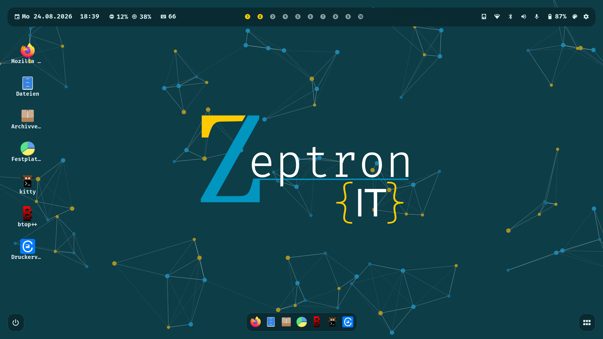

<sup>Jedes Bild in dieser Datei ist eine Aufnahme eines Programms aus **diesem**
Baum – kein Entwurf, kein Zusammenschnitt, keine Nachbearbeitung. 23 der 27
sind von `tests/render/` in einem geschachtelten Hyprland gemacht, mit der
ausgelieferten Tapete hinter dem Glas, in echten 1920×1080; die vier Bilder des
Installers kommen aus QEMU, vom Freigabemedium, und tragen deshalb einen
älteren Versionsstempel. [`docs/bilder/README.md`](docs/bilder/README.md) sagt,
wie jedes entsteht, was mit Absicht nicht darauf ist, wie auf Persönliches
geprüft wurde, und wie man sie neu macht.</sup>

---

## Alles, was auf dem Schirm steht

Jedes Fenster hier unten ist das ausgelieferte, aus diesem Commit. Ein Klick
auf ein Bild öffnet es in voller Größe.

<table>
<tr>
<td colspan="2" align="center">
<a href="docs/bilder/leiste.webp"></a><br>
<b>Die Leiste</b> · <sub>Datum, Last, zehn Arbeitsflächen, Ablage und acht Statusmodule – jedes davon öffnet etwas</sub>
</td>
</tr>
<tr>
<td width="50%" align="center" valign="top">
<a href="docs/bilder/starter.webp">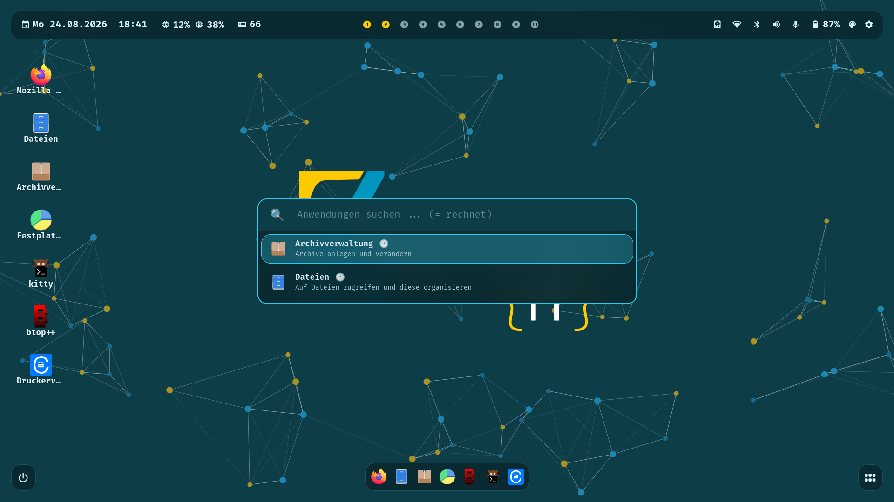</a><br>
<b>Der Anwendungsstarter</b><br><sub><code>SUPER+SPACE</code> – hyprlaunch mit dem ZepOS-Patch, und er rechnet auch</sub>
</td>
<td width="50%" align="center" valign="top">
<a href="docs/bilder/kontrollzentrum.webp">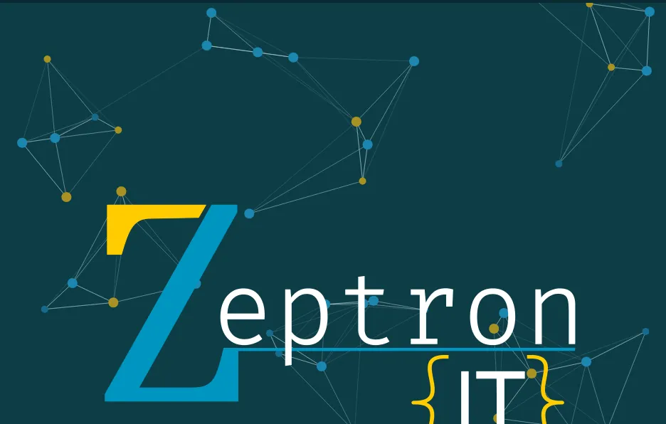</a><br>
<b>Das Kontrollzentrum</b><br><sub>ein Fenster, sechs Seiten, zwei Gruppen in der Seitenleiste</sub>
</td>
</tr>
<tr>
<td align="center" valign="top">
<a href="docs/bilder/dock-minimiert.webp"></a><br>
<b>Das Dock</b><br><sub>angeheftete Anwendungen, und rechts vom Trenner ein <i>minimiertes</i> Fenster</sub>
</td>
<td align="center" valign="top">
<a href="docs/bilder/sitzungsmenue.webp">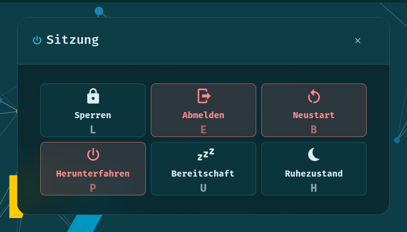</a><br>
<b>Das Sitzungsmenü</b><br><sub><code>SUPER+M</code> – sechs Aktionen, jede mit eigener Buchstabentaste</sub>
</td>
</tr>
<tr>
<td align="center" valign="top">
<a href="docs/bilder/tastenkuerzel.webp"></a><br>
<b>Die Kürzelliste</b><br><sub>aus der erzeugten Konfiguration gelesen, sie kann also nicht auseinanderlaufen</sub>
</td>
<td align="center" valign="top">
<a href="docs/bilder/stil-editor.webp">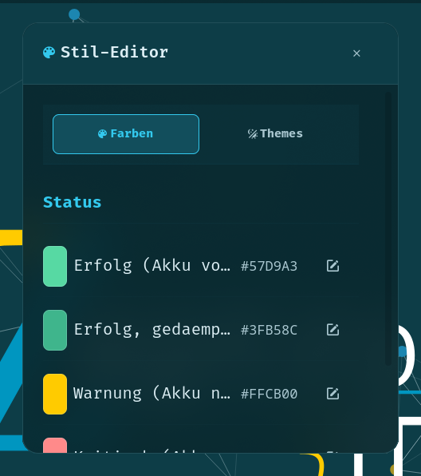</a><br>
<b>Der Stil-Editor</b><br><sub>69 Farbschlüssel, sofort wirksam, aus derselben Datei, die alles andere liest</sub>
</td>
</tr>
<tr>
<td align="center" valign="top">
<a href="docs/bilder/sperrbildschirm.webp"></a><br>
<b>Der Sperrbildschirm</b><br><sub><code>zepos-lock</code>, C und GTK4, auf <code>ext-session-lock-v1</code></sub>
</td>
<td align="center" valign="top">
<a href="docs/bilder/installer-einteilung.webp">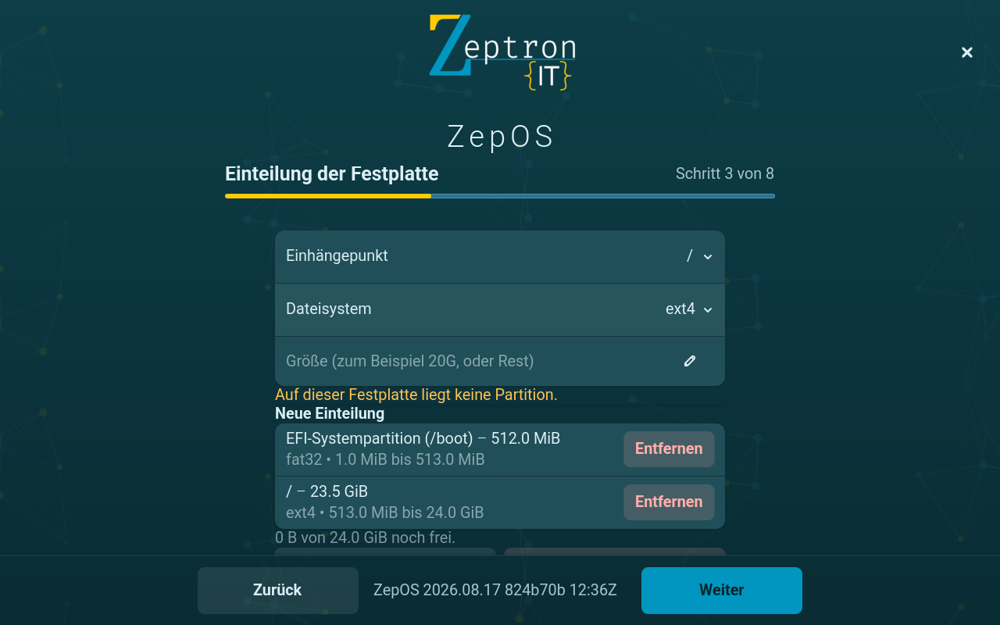</a><br>
<b>Der Installer</b><br><sub>acht Schritte, ein eigener – nicht archinstall mit einem Anstrich</sub>
</td>
</tr>
</table>

<details>
<summary><b>Und die übrigen siebzehn</b> – das Home und seine zwei Menüs, die Menüs von Dock und Starter, der Kalender, die Benachrichtigungen, beide Einstellungsfenster, das Auswahlfenster, ein 1366×768-Notebookschirm und drei weitere Schritte des Installers</summary>

### Das Home und seine zwei Menüs

Das Home ist die Fläche hinter allen Fenstern. Rechtsklick auf ein Symbol, oder
Rechtsklick auf die leere Fläche daneben – zwei Menüs, zwei Aufgaben:

<table>
<tr>
<td width="50%" align="center" valign="top">
<a href="docs/bilder/home-menue-symbol.webp">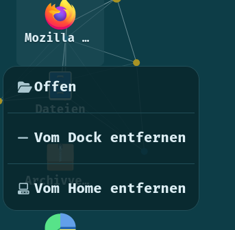</a><br>
<sub>auf einem Symbol</sub>
</td>
<td width="50%" align="center" valign="top">
<a href="docs/bilder/home-menue-flaeche.webp">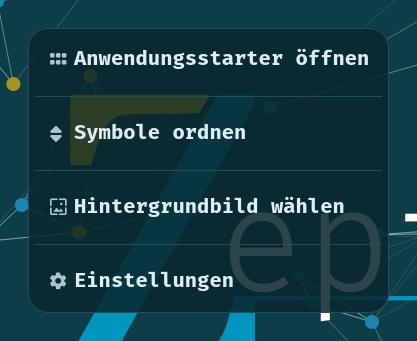</a><br>
<sub>auf der leeren Fläche</sub>
</td>
</tr>
</table>

### Derselbe Rechtsklick an den anderen zwei Orten

<table>
<tr>
<td width="33%" align="center" valign="top">
<a href="docs/bilder/dock.webp"></a><br>
<sub>das Dock, nichts läuft</sub>
</td>
<td width="33%" align="center" valign="top">
<a href="docs/bilder/dock-menue.webp">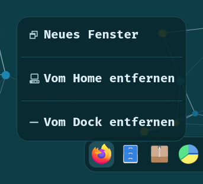</a><br>
<sub>Rechtsklick im Dock</sub>
</td>
<td width="33%" align="center" valign="top">
<a href="docs/bilder/starter-menue.webp">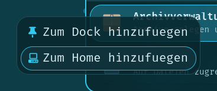</a><br>
<sub>Rechtsklick im Starter</sub>
</td>
</tr>
</table>

### Was die Leiste öffnet

<table>
<tr>
<td width="33%" align="center" valign="top">
<a href="docs/bilder/kalender.webp">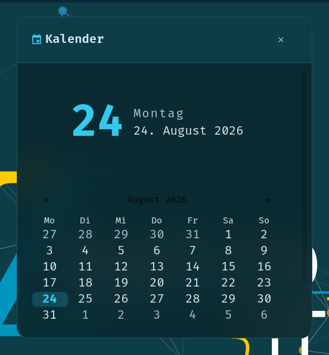</a><br>
<sub>der Kalender</sub>
</td>
<td width="33%" align="center" valign="top">
<a href="docs/bilder/benachrichtigung.webp">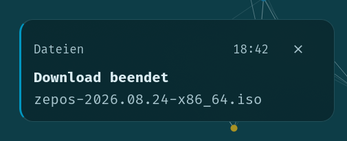</a><br>
<sub>eine Benachrichtigung kommt an</sub>
</td>
<td width="33%" align="center" valign="top">
<a href="docs/bilder/benachrichtigungszentrum.webp">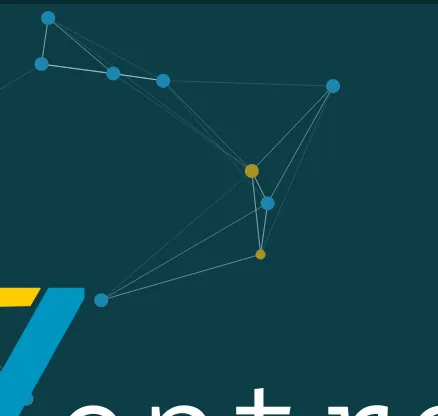</a><br>
<sub>das Benachrichtigungszentrum</sub>
</td>
</tr>
</table>

### Einstellungen – zwei Fenster, eine Einstellungsdatei

<table>
<tr>
<td width="33%" align="center" valign="top">
<a href="docs/bilder/einstellungsfenster.webp">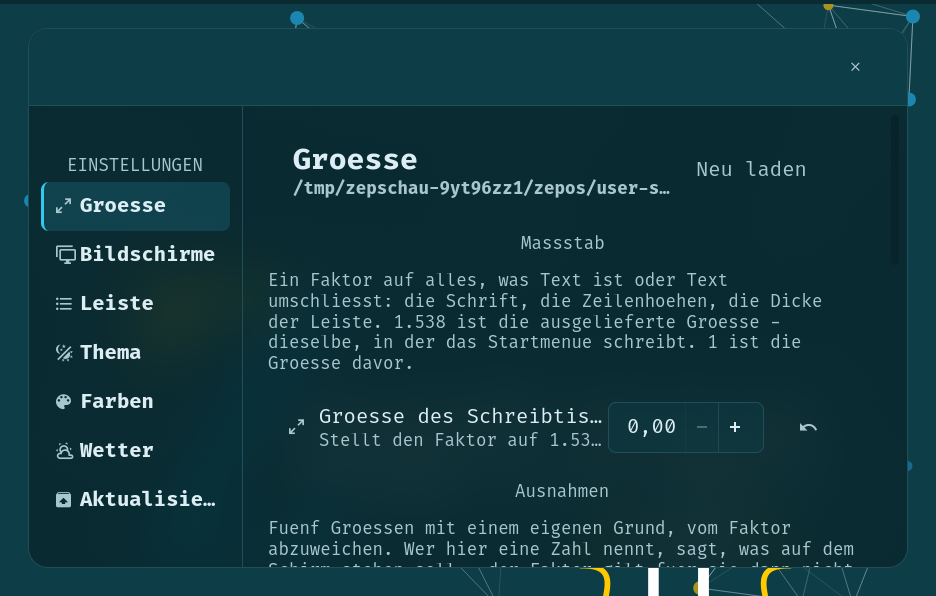</a><br>
<sub>das Einstellungsfenster der Oberfläche</sub>
</td>
<td width="33%" align="center" valign="top">
<a href="docs/bilder/einstellungen-app.webp">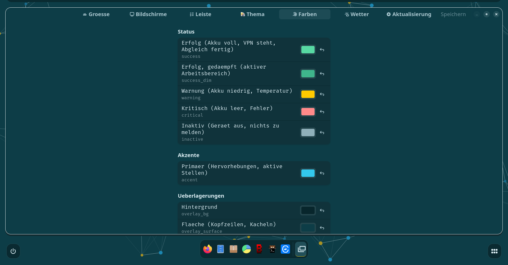</a><br>
<sub><code>zepos-settings-gui</code>, die eigene Anwendung</sub>
</td>
<td width="33%" align="center" valign="top">
<a href="docs/bilder/vpn-einstellungen.webp">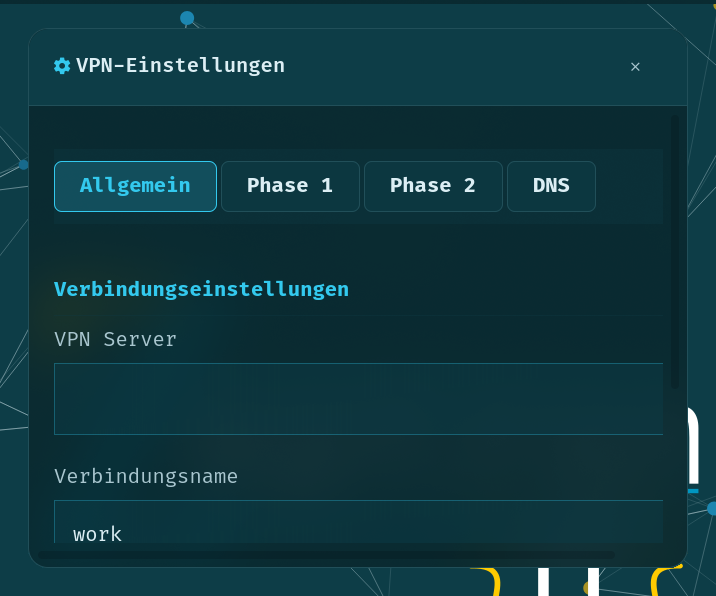</a><br>
<sub>die VPN-Einstellungen</sub>
</td>
</tr>
</table>

### Das Auswahlfenster, der Schreibtisch im Gebrauch, und ein Notebookschirm

`zepos-menu` ist das Auswahlfenster, durch das jede Liste in ZepOS geht –
Zwischenablage, Druckerauswahl, Geräteauswahl. Ein Fenster, ein Stil.

<a href="docs/bilder/auswahlfenster.webp">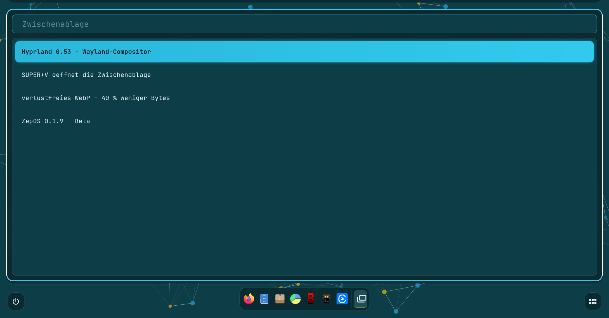</a>

Der Schreibtisch, während jemand daran arbeitet – der Dateiverwalter offen,
darüber die Leiste, darunter das Dock mit dem laufenden Fenster markiert:

<a href="docs/bilder/dateien.webp">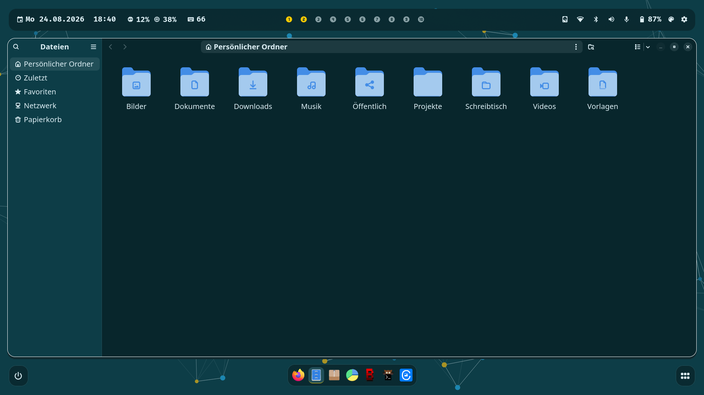</a>

Und derselbe Schreibtisch auf einem 1366×768-Notebookschirm. Die Leiste läuft
nicht über; sie legt drei ihrer Statusmodule hinter den Einklapp-Knopf rechts,
und genau dafür ist der da:

<a href="docs/bilder/schreibtisch-1366.webp">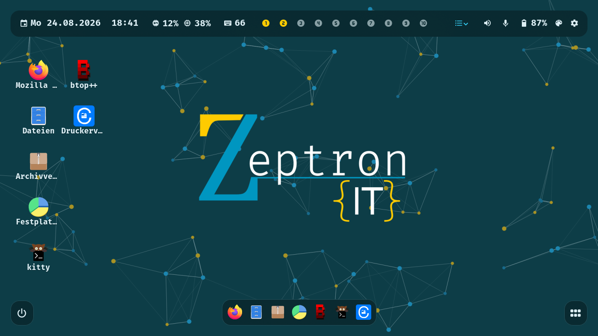</a>

### Drei weitere Schritte des Installers

Diese drei kommen nicht aus dem geschachtelten Compositor: sie stammen von
`./iso/test-boot.py --scenario release-install`, aus QEMU, vom Freigabemedium –
darum nennt der Versionsstempel am unteren Rand einen älteren Bau.

<table>
<tr>
<td width="33%" align="center" valign="top">
<a href="docs/bilder/installer-sprache.webp">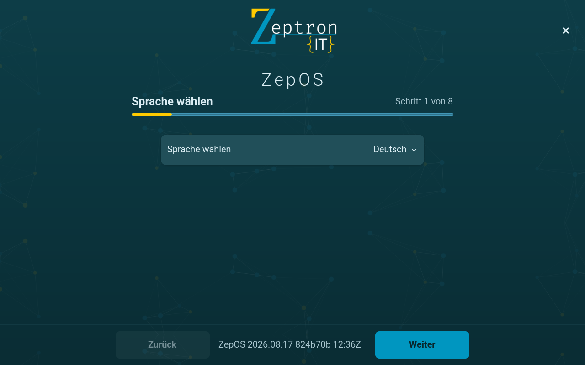</a><br>
<sub>Schritt 1 – Sprache</sub>
</td>
<td width="33%" align="center" valign="top">
<a href="docs/bilder/installer-bestaetigung.webp">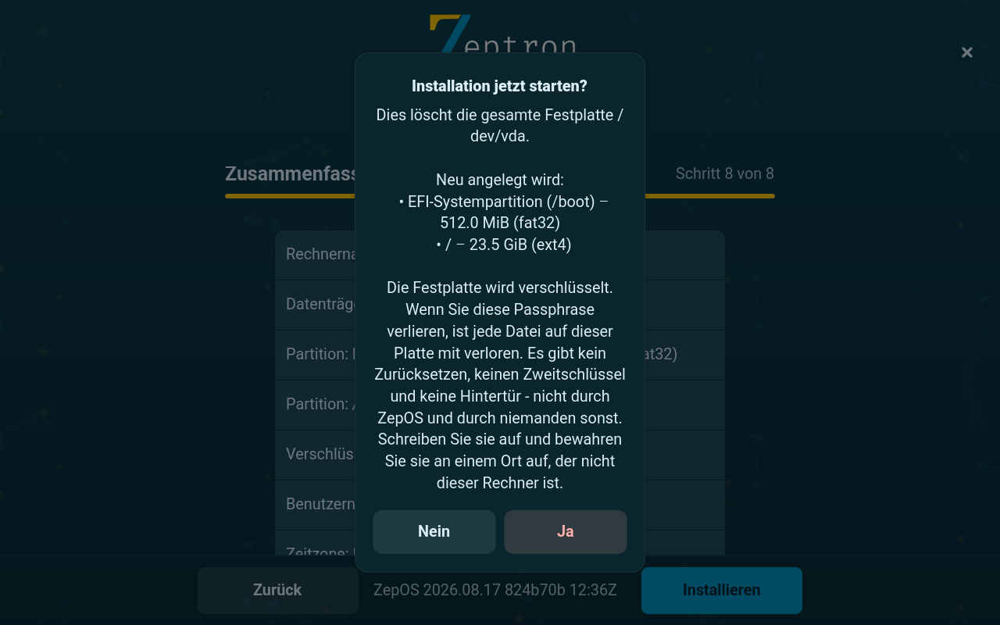</a><br>
<sub>Schritt 8 – die letzte Frage</sub>
</td>
<td width="33%" align="center" valign="top">
<a href="docs/bilder/installer-fertig.webp">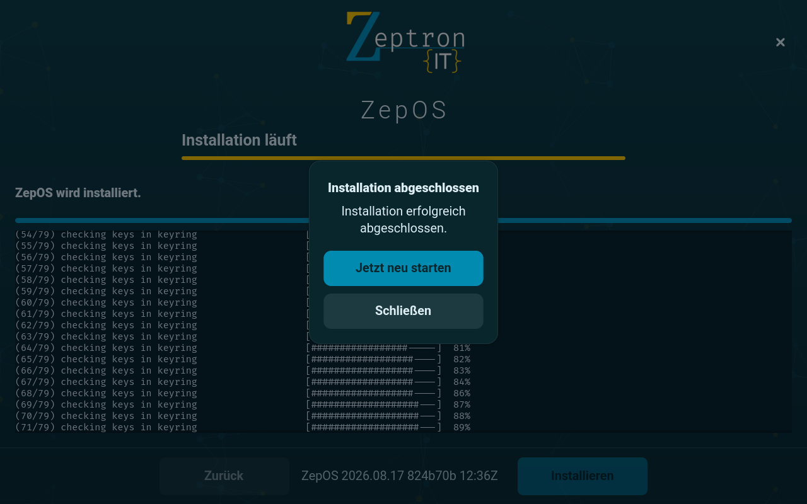</a><br>
<sub>fertig</sub>
</td>
</tr>
</table>

</details>

ZepOS ist eine Arch-basierte Linux-Distribution mit einem Hyprland/Wayland-
Desktop, ausgeliefert als bootfähiges Live-Medium mit eigenem grafischen
Installer. Alles, was auf dem Bildschirm steht – Installer, Anmeldemaske,
Leiste, Dock, Starter, Kontrollzentrum, Einstellungen, Sperrbildschirm,
Sitzungsmenü – ist für dieses Projekt geschrieben, ist GTK4, und bezieht
Farben, Abstände und Schriftgrößen aus einer einzigen Datei.

**Es ist Beta.** Es installiert sich, es läuft, und es aktualisiert sich selbst
aus einer signierten Paketquelle. Es ist außerdem auf genau einer physischen
Maschine und in QEMU installiert worden, es löscht die Platte, die man ihm gibt,
und es hat keine eigene Datensicherung und keinen Rückrollpunkt. Diese Datei
sagt, welche dieser Aussagen wann und womit gemessen wurde.

**Hinweis zur Sprache:** Diese Datei und [`README.md`](README.md) sind dasselbe
Dokument in zwei Sprachen; beide müssen bei jeder Änderung synchron gehalten
werden. Die Build-Skripte und die Entwicklerdokumentation sind Englisch;
Quelltextkommentare und die Designdokumente in `docs/` sind größtenteils
Deutsch. Die ausgelieferte Benutzeroberfläche ist Englisch und Deutsch.

---

## Was „Beta" hier heißt

Kein Etikett. Drei konkrete Aussagen, jede mit dem, was sie gemessen hat.

**Was funktioniert, und wobei jemand zugesehen hat.** Die Belege stehen in
[`iso/README.md`](iso/README.md), das festhält, was jeder Start und jede
Installation tatsächlich getan hat – nicht, was beabsichtigt war:

| | Gemessen mit |
|---|---|
| Das Medium startet auf UEFI-Firmware in den Installer | `./iso/test-boot.py --scenario release` |
| Jemand kann diesen Installer bis zu einer fertigen Installation führen | `--scenario release-install` |
| Was er installiert hat, startet ohne das Medium | `--scenario release-installed` |
| Eine installierte Maschine aktualisiert sich aus der öffentlichen Quelle, mit Signaturprüfung | `--scenario update`, dazu `./packaging/verify-install.sh` in saubere Container |
| Ohne Netz sagt das Medium etwas Verständliches, statt einzufrieren | `--scenario release-install-ohne-netz` |
| Firmware mit aktivem Secure Boot lehnt das Medium ab, und woran genau | `--scenario secure-boot` |

`./iso/test-boot.py --help` nennt alle zehn Szenarien.

**Was gerade veröffentlicht ist.** Eine feste Versionsnummer in dieser Datei
wäre am nächsten Tag falsch. Deshalb stehen hier die zwei Adressen, die die
Frage beantworten – und eine datierte Momentaufnahme dessen, was sie gesagt
haben:

- Pakete: <https://zeptronit.github.io/ZepOS/manifest.txt> nennt Version,
  Commit, den Arch-Stichtag und die sha256-Summe jedes Pakets.
- Medien: die [Releases-Seite](https://github.com/ZeptronIT/ZepOS/releases).

*Gemessen am 24.08.2026:* die Paketquelle lieferte **0.1.9 mit 24 Paketen**,
gebaut am `2026-08-24T14:06:09Z` aus Commit `54269d9` und signiert mit
`157C1725A578B80C`; das neueste Medium war weiterhin
**`zepos-2026.08.19-x86_64.iso`, 1 324 056 576 Byte (1,23 GiB)**, weil seither
keine Freigabe ein Abbild getragen hat. Baum und Paketquelle stehen heute beide
auf `0.1.9` – [`VERSION`](VERSION) sagt, wo der Baum steht, die zwei Links oben
sagen, was wirklich draußen ist; beim nächsten Commit gehen sie wieder
auseinander.

**Was Beta nicht heißt.** Nicht: fertig, nur mit Fehlern. Ganze Fähigkeiten
fehlen mit Absicht, und sie stehen unten beim Namen, unter
[Was heute nicht geht](#was-heute-nicht-geht). Diesen Abschnitt bitte lesen,
bevor irgendetwas installiert wird.

---

## KI zuerst – und genau, was das heißt

Die Zeile ganz oben ist eine Behauptung, also steht sie hier vollständig, mit
der Datei, die jeden Teil davon trägt. Nichts davon ist geplant, in Arbeit oder
demnächst; jede Zeile steht heute im Baum.

**Claude Code ist ein Paket dieser Distribution und nichts, was man hinterher
installiert.** `packaging/zepos-claude-code/PKGBUILD` baut es aus einem
angehefteten, sha256-geprüften Archiv der npm-Registry – in der
veröffentlichten Paketquelle Fassung `2.1.233-4` – und es ist mit demselben
Schlüssel signiert wie alles andere, was ZepOS ausliefert. `zepos-apps` hängt
davon ab, es kommt also mit dem Schreibtisch; es ist im Dock angeheftet und
liegt auf dem Home. Nach der ersten Anmeldung einer frischen Installation ist
der Agent bereits auf der Maschine.

**Ein gewöhnlicher Nutzer kann Agenten-Werkzeug global installieren, ohne
`sudo`.** ZepOS liefert Node 24 LTS und npm mit (`nodejs-lts-krypton`, `npm`,
beide Abhängigkeiten von `zepos-desktop`), und `/etc/npmrc` aus `zepos-config`
setzt npms Präfix auf `~/.local` – ein Verzeichnis, das die Shell und
`zepos-session` ohnehin im `PATH` haben. Eine Zeile genügt damit für einen
Orchestrierer, der Claude Code in mehreren Agentenrollen steuert:

```bash
npm i -g claude-flow
claude-flow --version
```

Kein root, und nichts wird in pacmans `/usr/lib/node_modules/` geschrieben. Die
eigene `~/.npmrc` gewinnt weiterhin gegen die Systemdatei – am 20.08.2026 in
einem leeren Container gemessen. **Ruflo (`claude-flow`) liegt mit Absicht
nicht vorinstalliert bei**; die Begründung steht unter
[Was installiert wird](#was-installiert-wird).

**Die Distribution ist so gebaut, dass ein Agent an ihr weiterarbeiten kann.**
Das ist der Teil, den man leicht unscharf sagt, also genau: Fast jede
Entscheidung in diesem Baum steht neben dem Code, den sie betrifft, samt der
Messung, aus der sie kam – das sind die Dateiköpfe in `src/` und `packaging/`.
Zwei einzige Quellen der Wahrheit sorgen dafür, dass eine Farbe oder ein
Zeichen an einer Stelle geändert wird und 88 Vorlagen erreicht. Und
`tests/conftest.py` installiert eine Isolationssicherung, die jedem Test
verbietet, einen Prozess zu starten oder außerhalb eines temporären
Verzeichnisses zu schreiben – das ist es, was es erträglich macht, die Suite
von etwas laufen zu lassen, das kein Mensch ist, auf einer Maschine, auf die es
ankommt. ZepOS ist selbst so geschrieben worden, mit Claude an der Tastatur für
einen großen Teil des Baums; die Gepflogenheiten sind der Rückstand davon und
keine Verkaufsposition.

### Was es nicht ist

Deutlich gesagt, weil eine README, die mehr verspricht als die erste
Installation hält, der teuerste Fehler ist, den eine Beta machen kann.

- **Kein lokales Modell und keine Inferenz.** Kein llama.cpp, kein ollama, kein
  GPU-/CUDA-/ROCm-Unterbau, keine quantisierten Gewichte. Nichts auf dem Medium
  führt ein Modell aus.
- **Keine KI im Schreibtisch selbst.** Kein Assistent in der Leiste, kein
  Eingabefeld für natürliche Sprache, keine Sprachsteuerung, keine KI im
  Installer, keine KI in Hilfe oder Diagnose. `zepos-doctor` ist gewöhnliches
  Python.
- **Kein Gedächtnis, keine Vektordatenbank, keine mitgelieferten
  Agentenrollen.** Es gibt keinen eingebetteten Speicher, kein Retrieval, kein
  ZepOS-eigenes Agenten-Gerüst und keinen ab Werk eingerichteten MCP-Dienst.
- **Claude Code braucht ein Anthropic-Konto und ein Netz.** Es ist Anthropics
  proprietäres Programm unter eigener Lizenz, nicht Teil von ZepOS' GPL, und
  ohne Netz tut es nichts. Wer es nicht will, entfernt das Paket.
- **„KI zuerst" heißt hier: der Arbeitsplatz, nicht das Innere des
  Betriebssystems.** ZepOS bringt einen Agenten in einem Schritt statt in fünf
  zum Laufen, und sein Baum ist so geschrieben, dass einer daran arbeiten kann.
  Es denkt nicht, und es führt kein Modell für Sie aus.

**Vorhaben, und deshalb nicht behauptet:** eine Assistenzfläche, die zum
Schreibtisch gehört statt zum Terminal. Das ist ein *Plan*, er steht noch nicht
in [`docs/specs/`](docs/specs/), und nichts in diesem Repository setzt
irgendeinen Teil davon um.

---

## Installieren

### 1. Ein Medium besorgen

Das ISO liegt auf der
[Releases-Seite](https://github.com/ZeptronIT/ZepOS/releases). Geprüft wird es
gegen die sha256-Summe, die **im Text der jeweiligen Release-Notiz** steht – die
Prüfsumme ist Text auf der Seite, keine Datei neben dem Abbild, `sha256sum -c`
hätte also nichts zu lesen:

```bash
sha256sum zepos-<datum>-x86_64.iso     # mit der Release-Notiz vergleichen
```

Dann mit dem Werkzeug auf einen USB-Stick schreiben, dem man ohnehin vertraut.
Ein veröffentlichtes Abbild hinkt `main` um so viel hinterher, wie seit dem
letzten vergangen ist; wer den heutigen Baum will, baut das Medium selbst –
siehe [Selbst bauen](#selbst-bauen).

### 2. Vier Dinge, die man vorher wissen muss

- **Der Rechner muss im UEFI-Modus gestartet sein.** Der Installer verweigert
  einen BIOS-Start und sagt das, statt eine Platte zu löschen, um dann
  herauszufinden, ob das Ergebnis überhaupt startet
  (`installer/core/firmware.py`).
- **Secure Boot muss aus sein.** Die Startkette trägt keine Signaturen;
  gemessen lehnt die Firmware `\EFI\BOOT\BOOTx64.EFI` rundheraus ab.
- **Eine Netzwerkverbindung ist nötig.** Das Medium bringt die ZepOS-Pakete
  mit, die Arch-Basis kommt aus dem Netz. Ohne Netz scheitert die Installation –
  höflich, und auch das ist gemessen.
- **Die gewählte Platte wird vollständig gelöscht.** Jede Partition wird neu
  geplant, keine übernommen. Es gibt kein Danebeninstallieren und kein
  Dual-Boot. Die Begründung steht im Kopf von `installer/core/layout.py`:
  vorhandene Partitionen zu behalten hieße, ihre Startsektoren auf den Sektor
  genau gegen das zu treffen, was `parted` tatsächlich vorfindet – und ein
  Fehler dabei bricht eine halb fertige Installation ab. Die Einteilungsseite
  zeigt vorher, was auf der Platte liegt.

Es gibt keinen Live-Desktop zum Ausprobieren. Das Release-Medium startet in den
Installer und in nichts sonst.

### 3. Wonach der Installer fragt

Neun Seiten: Sprache, Netzwerk, Platte, Einteilung, Verschlüsselung, Benutzer,
Zeit, ZepOS, Zusammenfassung. Es ist ein GTK4/libadwaita-Assistent; kann die
grafische Sitzung nicht starten, läuft derselbe Installer als Textoberfläche,
und dieser Rückfall geschieht, bevor irgendein Fenster gezeigt wird.

Die Plattenverschlüsselung ist LUKS2 und freiwillig. Wer sie nimmt, bekommt auch
den Startbildschirm – dort steht die Passphrasenabfrage. Auf einer
unverschlüsselten Platte bleibt er aus, weil er dort Schmuck über einem Weg
wäre, den niemand gemessen hat.

Einteilung, Bootloader und Basisinstallation übernimmt
[`archinstall`](https://github.com/archlinux/archinstall). Ein eigener
Partitionierer wäre Code, dessen Fehler fremde Festplatten löschen.

`zepos-install` nimmt **keine Kommandozeilenargumente**. Auf einem Werkzeug, das
Platten löscht, gibt es keinen `--config`-Schalter;
`ZEPOS_INSTALLER_SURFACE=gui` oder `=tui` erzwingt eine der beiden Oberflächen,
und das ist alles.

### 4. Die erste Anmeldung

Es gibt keine automatische Anmeldung – die Maske fragt immer. Die erste
Anmeldung eines Kontos erzeugt dessen gesamte Konfiguration aus den Vorlagen.
Gemessen am 20.08.2026, als es 94 Erzeugungsziele gab (heute sind es 98):
**1117 ms** für eine erste, vollständige Erzeugung und **260 ms** bei einer
Anmeldung, bei der sich nichts geändert hat – Unverändertes wird übersprungen,
der Rest läuft nebenläufig.

---

## Im Alltag

### Der Schreibtisch in fünf Minuten

77 Tastenbindungen sind ab Werk da, und die Liste dieser Bindungen wird *aus
der erzeugten Konfiguration gelesen* statt in einer zweiten Datei daneben
gepflegt – deshalb kann sie nicht auseinanderlaufen mit dem, was die Tasten
wirklich tun. Die vollständige Übersicht öffnet das Kürzel-Modul in der Leiste;
eine eigene Taste hat dieses Fenster noch nicht.

| Taste | Tut |
|---|---|
| `SUPER+SPACE` | Starter |
| `SUPER+SHIFT+H` | Alles auf einmal durchsuchen – Anwendungen *und* Tastenbefehle |
| `SUPER+Q` / `SUPER+SHIFT+Q` | Terminal (schwebend / gekachelt) |
| `SUPER+E` | Dateien |
| `SUPER+SHIFT+B` | Browser |
| `SUPER+B` | Dock ein- und ausfahren |
| `SUPER+M` | Sitzungsmenü – sperren, abmelden, neu starten, herunterfahren, Bereitschaft, Ruhezustand |
| `SUPER+L` | Bildschirm sperren |
| `SUPER+S` | Ausschnitt aufnehmen und beschriften |
| `SUPER+ALT+V` | Zwischenablage-Verlauf mit Favoriten – mit und ohne Plugin |
| `SUPER+1…0`, `SUPER+SHIFT+1…0` | Arbeitsfläche wechseln / Fenster mitnehmen |
| `SUPER+F` / `SUPER+SHIFT+F` | Vollbild / echtes Vollbild |
| `SUPER+SHIFT+X` | Fenster schließen |

Die rechte Hälfte der Leiste öffnet das Kontrollzentrum – ein Fenster, dessen
Seitenleiste sechs Seiten trägt: Netzwerk, Bluetooth, VPN, Allgemein, Ton und
Anzeige. Daneben stehen die Überlagerungen, die die anderen Leistenmodule
öffnen: Benachrichtigungen, Kalender, Datenträger, Akku, Hintergrund, die
Kürzelübersicht, der Stil-Editor und die Einstellungen. Alle sind aus demselben
Bausatz gebaut, damit eine Zeile, ein Knopf und eine Kopfzeile überall gleich
aussehen.


### Die drei Orte, an denen ein Programm liegen kann

**Das Home** ist eine Fläche hinter allen Fenstern, auf der die Programme als
Symbole liegen – anklickbar, mit der Maus verschiebbar, auf jedem Bildschirm.
Es speichert Gitter*plätze* und keine Bildpunkte, denn die nutzbare Fläche
ändert sich im Betrieb: mit eingefahrenem Dock ist sie 40 Punkte höher, und mit
gespeicherten Koordinaten wäre bei jedem `SUPER+B` jedes Symbol gewandert. Es
liegt auf der Ebene `bottom` und nicht auf `background`, wo swaybg das
Hintergrundbild malt und bei jedem Wechsel neu startet – gemessen wären die
Symbole nach dem ersten Bildwechsel verschwunden. Leerlaufkosten, gemessen:
0,00 % CPU, sichtbar wie verdeckt.

**Das Dock** trägt die angehefteten Programme und rechts daneben, leicht
abgeblendet, die *minimierten* Fenster. Minimieren schiebt ein Fenster auf den
Sonderarbeitsbereich `minimized`; ein Klick holt es auf die Arbeitsfläche, die
man gerade ansieht, **ohne** den Tastaturfokus mitzunehmen – von den drei
Hyprland-Befehlen, die dafür infrage kamen, tut das genau
`movetoworkspacesilent`, und von den anderen beiden ist gemessen, dass sie
etwas anderes tun. Beide Eckknöpfe – links Abschalten, rechts Starter – fahren
mit dem Dock auf `SUPER+B` ein.

**Der Starter** auf `SUPER+SPACE`. Rechtsklick wirkt an allen drei Orten, und
jedes Menü kann ein Programm an den *anderen* Ort schieben:

| Rechtsklick im … | … auf ein Programm |
|---|---|
| **Home** | Zum Dock hinzufügen · Vom Home entfernen |
| **Dock** | Zum Home hinzufügen · Vom Dock entfernen |
| **Starter** | Zum Dock hinzufügen · Zum Home hinzufügen |

Liegt das Programm am Zielort schon, schlägt der Punkt auf „entfernen" um,
statt zu verschwinden – ein Rechtsklick, der mal wirkt und mal nicht, ist
schlimmer als einer, der immer sagt, was er tun wird. Die Änderung kommt ohne
Neuanmeldung überall an: jede Fläche überwacht die Einstellungsdatei, gemessen
rund **40 ms**, in allen drei Richtungen.

Alle drei Menüs stehen oben unter [Alles, was auf dem Schirm steht](#alles-was-auf-dem-schirm-steht)
nebeneinander – und ebenso, wie der Schreibtisch aussieht, während
jemand daran arbeitet.

### Was installiert wird

`zepos-desktop` ist ein Metapaket, und seine `depends`-Liste ist die Stelle, an
der die Gestalt eines installierten ZepOS entschieden wird. Die Regel steht im
Kopf seines PKGBUILD: *eine Abhängigkeit ist ein Programm, das die erzeugte
Konfiguration selbst startet, oder eines, das eine Standardbindung braucht, um
zu tun, was die Taste verspricht.*

Es zieht Hyprland mit fünf Plugins herein, die AGS-Leiste, das Dock und die
Schale, die ZepOS-Programme für Menü, Sperre und Einstellungen, und `zepos-apps`
– die Auswahl *fremder* Anwendungen, die ZepOS trifft: Firefox, Nautilus, Loupe,
Papers, Celluloid, GNOME Texteditor, Taschenrechner, Baobab, File Roller, btop,
CUPS, und kitty als Terminal. Jede wurde GTK4-zuerst gewählt, wo es eine
GTK4-Fassung gibt, und die Begründung steht neben dem Namen in
`packaging/zepos-apps/PKGBUILD`. Firefox ist die bewusste Ausnahme: er ist GTK3,
und ein Browser, den der Nutzer beim Namen genannt hat, wiegt schwerer als eine
Regel, die von *unseren eigenen* Oberflächen handelt.

Zwei freiwillige Gruppen werden nicht mitinstalliert: `zepos-apps-office`
(LibreOffice mit deutschen Wörterbüchern) und `zepos-apps-devel` (`base-devel`,
`git`).

`zepos-apps` enthält außerdem **Claude Code**, als `zepos-claude-code` aus einem
festgenagelten, prüfsummengesicherten Upstream-Tarball gebaut und im Dock
angeheftet. Es ist Anthropics proprietäres Kommandozeilenwerkzeug unter eigener
Lizenz, nicht Teil von ZepOS' GPL, und es braucht ein Anthropic-Konto, um
überhaupt etwas zu tun. Wer es nicht will, entfernt das Paket.

**Ruflo wird nicht mitgeliefert, und das ist eine Entscheidung.** Ruflo (auf
npm: `claude-flow`) ist ein Orchestrator, der Claude Code steuert. Es war vom
19. bis zum 20. August 2026 ein Paket und ist wieder gefallen: es steuert Claude
Code, Claude Code spricht mit der Anthropic-API, und ohne Netz tut beides
überhaupt nichts. Der einzige Vorteil des Vorinstallierens – Unabhängigkeit vom
Netz – existiert für dieses Werkzeug also gar nicht, und ein Paket hätte es auf
eine Fassung festgenagelt, während npm laufend neue ausliefert.

ZepOS bringt Node 24 LTS und npm mit, ein Befehl holt es – **ohne `sudo`**:

```bash
npm i -g claude-flow
claude-flow --version
```

`/etc/npmrc` setzt npms Präfix auf `~/.local`, das Programm landet also als
`~/.local/bin/claude-flow`, in einem Verzeichnis, das ohnehin im PATH liegt. Ein
globales `npm i -g` braucht hier kein root und schreibt nicht in pacmans
`/usr/lib/node_modules/`. Die eigene `~/.npmrc` gewinnt trotzdem – gemessen am
20.08.2026 in einem leeren Container.

### Aktualisierungen

Eine installierte Maschine aktualisiert sich selbst: ein täglicher Zeitgeber,
verzögert nach dem Start und zusätzlich zufällig gestreut, der **nur anfasst,
was aus `[zepos]` kommt**. Die Arch-Basis wird gezählt und gemeldet, nie
eingespielt – außer man setzt `update.scope=all`. Ein unbeaufsichtigtes
`pacman -Syu` auf einem Rolling Release ist ein Rechner, der eines Morgens nicht
mehr startet, und sein Besitzer hat ihn nicht kaputtgemacht.

Von Hand:

```bash
sudo zepos-update                    # einspielen, was ansteht, danach neu erzeugen
sudo zepos-update --check            # nur nachsehen und sagen, was ansteht
sudo zepos-update --status           # was der letzte Lauf getan hat
sudo zepos-update --apply-schedule   # NUR den Zeitgeber stellen; spielt nichts ein
```

Der Unterschied, den niemand erraten muss: **Was Pakete austauscht, ist
`zepos-update` ohne Argument (oder `--now`).** `--apply-schedule` schreibt eine
systemd-Ergänzung und sonst nichts. Sein alter Name `--apply` gilt weiter, weil
`/usr/share/libalpm/hooks/90-zepos-update.hook` ihn so ruft und ein Haken auf
der Platte von genau der Aktualisierung gerufen wird, die ihn ersetzt – aber ein
Mensch, der ihn tippt, bekommt gesagt, dass nichts eingespielt wurde.

Die andere Hälfte ist die Neuerzeugung. Steht eine aus **und** hängt ein
Terminal an diesem Lauf **und** ist das aufrufende Konto grafisch angemeldet,
dann läuft `zepos-generate --all` als dieses Konto gleich hinterher und die
Schale startet neu – ohne Neuanmeldung. Der Zeitgeber, der keine dieser drei
Bedingungen erfüllt, hinterlässt statt dessen eine Marke, und die nächste
Anmeldung erzeugt neu, bevor der Compositor startet. `--regenerate` erzwingt es
in jedem Fall; `zepos-update --check` sagt, ob eine aussteht.

### Einstellungen

Zwei Oberflächen über einem Hirn, und sie können sich nicht widersprechen, weil
nur eine von ihnen etwas entscheidet:

```bash
zepos-settings get                   # jede Einstellung mit ihrem aktuellen Wert
zepos-settings set sizes.scale 1.25
zepos-settings set colors.<schluessel> '#...'
zepos-doctor                         # was eine erzeugte Konfiguration an sich selbst nicht prüfen kann
```

Das Einstellungsfenster hat sieben Seiten – Größe, Bildschirme, Leiste, Thema,
Farben, Wetter, Aktualisierung. Jeder der 69 Farbschlüssel, die aus ZeptronITs
sechs Markenfarben abgeleitet sind, ist erreichbar, und die erste Themenvorlage
des Stil-Editors *ist* die ausgelieferte Palette statt einer Kopie davon.

### Etwas ändern

Nichts in einem laufenden ZepOS ist eine Konfigurationsdatei, die jemand
bearbeitet hat; alles ist erzeugt, trägt einen „DO NOT EDIT"-Kopf und wird beim
nächsten Lauf überschrieben. Das sperrt niemanden aus – es verschiebt die
Änderung um einen Schritt nach hinten:

```bash
mkdir -p ~/.config/zepos/templates
cp /usr/share/zepos/templates/hyprland-universal-config.template ~/.config/zepos/templates/
$EDITOR ~/.config/zepos/templates/hyprland-universal-config.template
zepos-generate --all
```

Eine Vorlage unter `~/.config/zepos/templates/` gewinnt gegen die
gleichnamige aus dem Paket, und eine Paketaktualisierung kann sie nicht
überschreiben. Genau das tut auch der Bearbeiten-Knopf im Kürzelfenster – was
dieser Knopf *nicht* ist, steht unter
[Was heute nicht geht](#was-heute-nicht-geht).

Die Erzeugung ist atomar: in ein temporäres Verzeichnis schreiben, prüfen, dann
verschieben. Ein gescheiterter Lauf lässt die vorige, funktionierende
Konfiguration stehen.

---

## Was heute nicht geht

Alles hier ist gemessen oder aus diesem Baum gelesen. Nichts ist abgemildert,
und nichts, was beim Schreiben dieser Datei gefunden wurde, ist weggelassen.

### Harte Grenzen

- **Nur x86_64.** Arch selbst liefert offiziell nur x86_64, und ZepOS baut auf
  Archs eigenem Werkzeug und Archiv auf – die Grenze ist geerbt, nicht gewählt.
  Um die eine CPU zu nennen, nach der gefragt wird: ein AMD Ryzen ist x86_64.
- **Nur UEFI, und Secure Boot aus.** Beides gemessen, siehe
  [Installieren](#installieren).
- **Zur Installation ist eine Netzwerkverbindung nötig.**
- **Die Platte wird gelöscht. Kein Dual-Boot, keine Migration.** ZepOS wird
  installiert, nicht umgewandelt.
- **Keine eigene Datensicherung, kein Rückrollpunkt.** Die Roadmap führt
  „Datensicherung und Wiederherstellung" als offen, mit dem Satz, den es
  verdient: ein Betriebssystem ohne Weg zurück ist ein Versuchsaufbau. Bis es
  das gibt, ist der Weg zurück die eigene Sicherung – angelegt *bevor*
  installiert wird.
- **Zwei Sprachen: Deutsch und Englisch.** Beide werden von Tests vollständig
  gehalten – eine englische Zeichenkette ohne deutsche Übersetzung lässt die
  Suite scheitern.
- **Ein Desktop, und der heißt Hyprland.** Das ist der Sinn des Projekts, keine
  Lücke.
- **Die Hardwareabdeckung ist eine physische Maschine plus QEMU.** Es gibt keine
  Hardware-Matrix und keine Aussage über deine.

### Raue Kanten, einzeln benannt

- **Die Bildschirme lassen sich im neuen Einstellungsfenster nicht gegeneinander
  verschieben.** Je Schirm kann es an/aus, Auflösung, Maßstab und Drehung. Das
  Ziehen der Monitore gibt es nur im älteren GTK-Fenster
  (`zepos-settings-gui --page bildschirme`), weil dort die Zeichenfläche mit der
  Zieh-Geste liegt. Die neue Seite sagt das ausdrücklich, statt einen Knopf
  anzubieten, der nichts tut.
- **Das VPN-Fenster steht 42 px waagerecht über.** Gemessen: sein Inhalt
  braucht 702 px, die Sprosse, auf der es steht, gibt ihm 634. Das ist eine
  Sprossenwahl, kein Rundungsfehler, und beide Auswege verändern sichtbar ein
  Fenster, über das niemand geklagt hat – deshalb steht es hier, statt still
  geflickt zu werden.
- **Es gibt keinen Kürzel-Editor.** Der Bearbeiten-Knopf im Kürzelfenster öffnet
  die *Vorlage* der Tastenbindungen in einem Texteditor. Keine Tastenaufnahme,
  keine Konfliktprüfung, keine Oberfläche je Bindung.
- **Die Anmeldemaske ist nur halb übersetzt.** Sie ist `greetd`, das `regreet`
  in `cage` ausführt, gestaltet aus derselben Markendatei wie alles andere –
  aber `regreet` selbst übersetzt zwei der acht Beschriftungen. Die anderen
  sechs sind Englisch, gleich in welcher Sprache installiert wurde.
- **Ein einzelnes Paket neu zu bauen, von dem andere abhängen, schlägt fehl.**
  `packaging/build.sh` entfernt den alten Stand, bevor es das gebaute Repository
  in den Container installiert; ein abhängiges Paket lässt sich in genau diesem
  Moment nicht auflösen. Zweimal umgangen, indem der ganze Abhängigkeitskreis
  zusammen gebaut wurde – nicht behoben.
- **Der Testaufbau hat kein GTK-Thema.** Eine ganze Fehlerklasse – eine
  Themavorgabe, die unser Stylesheet nie zurücksetzt – ist dort strukturell
  unsichtbar. Der weiße Ring, den das Systemthema um die Dock-Symbole malte, war
  der erste Fund dieser Art, und gefunden hat ihn ein Mensch vor einem
  Bildschirm.
- **Die Suite lässt sich nicht in einem Aufruf sammeln.**
  `tests/render/test_home.py` und `tests/src/test_home.py` tragen denselben
  Basisnamen, und pytest importiert Testdateien über ihren Basisnamen – die
  zweite, die es erreicht, ist ein Import-Konflikt. Zählen braucht zwei
  Befehle, siehe [Tests](#tests). Offen seit 0.1.8.
- **Ein vollständig geleertes Home behält sein letztes Bild**, bis etwas
  anderes es neu zeichnet. Offen seit 0.1.8.
- **Der Abstand zwischen Symbol und Text schwankt in den drei
  Rechtsklick-Menüs sichtbar zwischen 9 und 12 px.** Die Sprosse stimmt; die
  Tinte der Zeichen ist verschieden breit. Die saubere Lösung säße im
  gemeinsamen Zeilen-Bauteil und beträfe jedes Fenster. Offen seit 0.1.6.
- **Der Bluetooth-Kopplungsdialog ist Bluemans, nicht unserer.** 0.1.9 hat eine
  Sicherheitslücke geschlossen – bis dahin hatte `bluetoothd` überhaupt keinen
  Kopplungsagenten, und der Kernel bestätigte Kopplungen still selbst –, indem
  es Bluemans Agenten mit `KeyboardDisplay` registriert und ihm eine
  Fensterregel gibt. Sieben Blueman-Module und dessen eigene Benachrichtigungen
  sind abgeschaltet, weil sie denselben Adapter anfassen wie die Leiste. Ein
  eigener Kopplungsagent als AGS-Fenster ist in Arbeit; bis dahin gehört eine
  Fläche auf diesem Schreibtisch jemand anderem.
- **Der Stand der Suite am 24.08.2026**, damit ein grüner Lauf nicht
  vorausgesetzt wird: 3254 bestanden, 13 übersprungen und acht, die nicht grün
  sind. `test_no_program_opens_a_layer_shell_window_without_a_rule` fällt über
  einen *Bauabfall* unter `iso/work/` und nicht über Quelltext – der Wächter
  liest den ganzen Baum, und ein unaufgeräumtes `iso/work/` legt ihm eine
  zweite Kopie von `zepos-menu` vor. `tests/src/test_home.py` ist der
  Sammelfehler von oben. Die restlichen sechs sind
  `tests/render/test_schale_stil.py`, dessen Modulvorrichtung bis zu 45 s auf
  die Fläche des Kontrollzentrums wartet und sie manchmal nicht bekommt; die
  Datei selbst hält die Messung fest und benennt den Verdächtigen (ein
  bedingungsloses `grab_focus()` auf der VPN-Seite, das bei jedem Öffnen der
  Schale feuert, welche Seite auch immer gerade sichtbar ist).

### Was kein Test abdeckt

Das gehört deutlich gesagt, weil es die Form der Fehlermeldungen erklärt, die
dieses Projekt bekommt. Die Suite prüft, *welche* Bauteile eine Vorlage aufruft,
und rechnet Kontraste; `tests/render/` misst echte Geometrie unter einem
verschachtelten Compositor, aber nur für eine Handvoll Oberflächen. **Kein Test
zeichnet ein Fenster und beurteilt, wie es aussieht.** Ein Layout kann in jeder
sichtbaren Hinsicht falsch sein, während die ganze Suite grün ist. Diese Lücke
ist bekannt, sie wird Messung für Messung enger, und bis sie zu ist, schlägt
eine menschliche Meldung einen grünen Lauf.

Die Bilder in dieser Datei kommen aus genau diesem Aufbau – deshalb lassen sie
sich aus jedem Checkout neu machen, und deshalb sind sie ein Beleg über
*Geometrie und Farbe* und keiner über Geschmack. Beim Machen fielen zwei Dinge
auf, die eine grüne Suite nicht gemeldet hatte: `tests/render/shoot.py`
behauptet im eigenen Kopf, die Leiste stehe auf einem 1366×768-Schirm
vollständig – sie tut es nicht, drei Statusmodule liegen hinter dem
Einklapp-Knopf, und das ist auf dem Bild oben zu sehen. Und das Home führt
`xdg-desktop-portal-gnome`, einen Diensteintrag mit `NoDisplay=true`, den
`desktop_entries.installed()` für das Dock heraushält; das Home wendet
denselben Filter nicht an. Beides steht hier, statt nebenbei geflickt zu
werden.

### Signatur und Lizenzen

- Ein **lokal gebautes** Medium ist mit einem Wegwerfschlüssel signiert
  (`packaging/make-test-key.sh`, Benutzer-ID `ZepOS TEST KEY - DO NOT TRUST`,
  ohne Passphrase, 90 Tage Laufzeit). Der echte Schlüssel gelangt nie in einen
  Arbeitsbaum.
- Die **veröffentlichte** Paketquelle ist mit einem echten Schlüssel signiert –
  `FF2EB06C08A57FEA9E33FC46157C1725A578B80C`, Benutzer-ID
  `LeonMarzollDev (ZepOS Release)`, gültig bis 18.08.2028. Siehe
  [Pakete und Signatur](#pakete-und-signatur).
- **Drei der fünf Compositor-Plugins stammen aus einem Upstream-Baum ganz ohne
  Lizenz.** ZepOS hat die Erlaubnis, sie zu bauen und zu patchen; man erbt
  dadurch nicht automatisch eine eigene. Siehe [Lizenz](#lizenz) – das ist die
  eine Grenze hier, die eine rechtliche Tatsache ist und keine fehlende
  Funktion.

---

## Für wen das hier ist, und für wen nicht

**Für** Menschen, die einen Hyprland-Desktop wollen, der konfiguriert, in sich
stimmig und installierbar ist – statt an einem Wochenende aus einem
Dotfiles-Repository zusammengesetzt. Und für Menschen, die lesen wollen, *warum*
ein System so gebaut ist, wie es gebaut ist: fast jede Entscheidung in diesem
Baum steht neben dem Code, mit der Messung, aus der sie stammt.

**Nicht für** jemanden, der Secure Boot braucht, eine Installation ohne Netz,
eine zweite Desktop-Umgebung, eine andere Architektur als x86_64 – oder eine
Maschine, deren Inhalt wichtig ist und nirgendwo sonst gesichert liegt.

---

## Wie es aufgebaut ist

### Das Vorlagensystem ist der Kern

Zwei einzige Wahrheitsquellen – `src/icon_definition.py` für Zeichen und
`src/style_definition.py` mit `src/brand.py` und `src/sizes.py` für Farben,
Größen und Abstände – speisen einen Prozessor, der `{{ICON_*}}`- und
`{{STYLE_*}}`-Platzhalter in **88 Vorlagen** unter `src/templates/` und **8
Stilvorlagen** unter `src/styles/` ersetzt, aus denen `zepos-generate`
**98 Ziele** macht. Heraus kommt die Konfiguration, die Hyprland, AGS, kitty
und der Rest wirklich lesen.

```
icon_definition.py ─┐
brand.py ───────────┼─► template_processor.py ─► generate_config.sh ─► ~/.config/{hypr,ags,kitty,…}
style_definition.py ┘        (88 + 8 Vorlagen)       (zepos-generate, 98 Ziele)
user-settings.json ─┘
```

```bash
zepos-generate --all          # alles neu erzeugen
zepos-generate --help         # jedes einzelne Ziel
```

### Der Installer ist drei Schichten, und die Oberfläche spricht nie mit archinstall

| Schicht | Inhalt |
|---|---|
| `installer/core/` | Datenmodell, Prüfung, Plattenerkennung, LUKS2, Funk, Übersetzung nach `archinstall` |
| `installer/gui/` | Der GTK4/libadwaita-Assistent |
| `installer/tui/` | Textoberfläche, wenn die grafische Sitzung nicht startet |

Die Oberfläche füllt ein serialisierbares Konfigurationsmodell; eine
Übersetzungsschicht macht daraus archinstalls JSON; ein Läufer ruft dessen
dokumentierte Kommandozeile auf. Die beiden Oberflächen sind damit austauschbar,
und eine unbeaufsichtigte Installation braucht keinen zweiten Codeweg –
`InstallConfig.from_dict()` plus `installer.core.runner.install()` ist alles.

Funkzugangsdaten werden absichtlich in das installierte System übernommen: eine
Verbindung in der Live-Umgebung verschafft dem installierten System keinen
Netzzugang, und ein Laptop ohne Ethernet-Buchse startete sonst ohne jeden Weg
ins Netz.

Die Paketquelle, *mit* der installiert wird, ist nicht die, die bleibt. Eine
Offline-Installation liest ihre ZepOS-Pakete aus `file:///opt/zepos-repo` auf
dem Medium; `installer/core/pacmanconf.py` entfernt jeden `[zepos]`-Abschnitt
aus der `pacman.conf` des Ziels und hängt genau einen an, der auf die
Online-Quelle zeigt. Ersetzen statt bearbeiten ist das, was das Ergebnis
unabhängig davon macht, wie viele es vorher waren.

### Pakete und Signatur

`packaging/` enthält **19 Rezepte, aus denen 24 Pakete entstehen**, gebaut in
Abhängigkeitsreihenfolge in einem Container, der auf denselben Stichtag des
Arch-Linux-Archivs festgenagelt ist wie das ISO. Der private Signierschlüssel
betritt den Baucontainer nie: gebaut wird dort, signiert wird danach auf dem
Wirt.

Die veröffentlichte Paketquelle und jedes Paket darin sind mit
`FF2EB06C08A57FEA9E33FC46157C1725A578B80C` signiert, Benutzer-ID
`LeonMarzollDev (ZepOS Release)`, gültig bis 18.08.2028. Der Hauptschlüssel kann
nur beglaubigen (`[C]`); ein eigener Unterschlüssel (`[S]`) signiert tatsächlich
– die übliche Trennung zwischen dem Schlüssel, der für die anderen bürgt, und
dem, der täglich benutzt wird. Seine öffentliche Hälfte liegt unter
[`zeptronit.github.io/ZepOS/zepos-repo.pub`](https://zeptronit.github.io/ZepOS/zepos-repo.pub),
und das Paket `zepos-keyring` bringt dieselbe Datei mit – das ist es, was ein
frisch installiertes System ihm vertrauen lässt, ohne dass jemand einen
Fingerabdruck von Hand tippt. Die Mechanik steht in `packaging/README.md`.

### Was auf dem Bildschirm steht, und warum wir es selbst geschrieben haben

| | Ersetzt | Warum |
|---|---|---|
| `zepos-menu` | wofi | GTK3, und sechs erzeugte Aufrufstellen hängen an dem Auswahlfenster |
| Sitzungsfenster (AGS) | wlogout | GTK3, Upstream seit 2024 tot |
| `zepos-lock` | hyprlock | Zeichnet mit GLES und Cairo, seine Farben konnten nie aus `brand.py` kommen |
| AGS-Leiste und Dock | waybar, nwg-dock-hyprland | waybar ist gtkmm-3; nwg-dock hat keine GTK4-Fassung |
| `zepos-settings-gui` | nwg-displays | GTK3, und sein „Einstellungen behalten?"-Zeitgeber stirbt mit dem Programm, das er schützen soll |
| `hyprlaunch`, `hyprclipx` | — | Gebaut aus [azzuriels](https://github.com/azzuriel) Plugins, von ZepOS gepatcht; 116 Zeilen fest verdrahtetes CSS durch erzeugte Stylesheets ersetzt. Siehe [Lizenz](#lizenz) |

GTK4 durchgehend ist eine harte Regel, keine Vorliebe: ein GTK3-Bauteil ist ein
Bauteil, dessen Farben und Abstände nicht aus derselben Quelle kommen können wie
alles andere – und genau diese eine Eigenschaft lässt eine Distribution wie ein
System aussehen. Die Regel gilt für Oberflächen, die ZepOS selbst baut, nicht
für fremde Anwendungen; deshalb ist Firefox hier.

Zwei Oberflächen trifft ein Nutzer, bevor er den Schreibtisch sieht:

- **Die Anmeldemaske** ist `greetd`, das `regreet` in `cage` ausführt, mit
  `tuigreet` auf der Konsole als Rückfall, falls der grafische Versuch zweimal
  scheitert. Sie folgt der Sprache, in der die Maschine installiert wurde – mit
  dem Vorbehalt unter [Was heute nicht geht](#was-heute-nicht-geht).
- **Der Startbildschirm** ist ein erzeugtes Plymouth-Thema, abgeleitet aus
  `brand.py` und dem Logo, eingecheckt und von einem Test neu abgeleitet. Er
  wird **nur bei verschlüsselten Installationen** eingeschaltet. Das Einschalten
  schreibt `mkinitcpio.conf` um, prüft das Ergebnis und nimmt es bei jedem
  Zweifel zurück.

---

## Gestaltungsentscheidungen, die man kennen sollte

- **Der Schreibtisch muss auch dann starten, wenn Plugins scheitern.**
  Hyprland-Plugins hängen an einer exakten Hyprland-Fassung; zieht eine
  Nebenversion an, bevor die Plugin-Pakete neu gebaut sind, entsteht eine
  Maschine, deren Plugins nicht laden können. Alles, was ein geladenes Plugin
  braucht, steht in einer erzeugten Datei, und ein Block wird nur geschrieben,
  wenn das übersetzte Objekt auf der Maschine liegt; sonst steht an seiner
  Stelle ein Kommentar, der das Objekt, sein Paket und den Befehl dagegen nennt.
  Ohne jedes Plugin besteht die Datei nur aus Kommentaren – und das ist immer
  noch eine Konfiguration, die durchgeht. Gemessen mit
  `Hyprland --verify-config`, in beide Richtungen zugesichert von
  `tests/src/test_plugins.py`. Eine Fassungsdifferenz kostet eine Funktion,
  keine Sitzung.
- **Kontrast ist eine Frage der Richtigkeit, nicht des Geschmacks.** WCAG AA
  verlangt 4,5:1 für Text, und der Markenakzent erreicht das nicht – `#0096C0`
  auf `#0D3D47` sind 3,45:1. Deshalb ist das Cyan, das *gelesen* wird, derselbe
  Farbton, aufgehellt auf 6,04:1, während das unangetastete `#0096C0` dort
  bleibt, wo es *gesehen* wird. Die Tests rechnen jedes Paar neu, statt den
  Zahlen daneben zu glauben. Grün und Rot sind absichtlich **nicht** auf Marke:
  eine Distribution, die ihre Fehlerzustände in das Firmen-Cyan umfärbt,
  versteckt Fehler, um aufgeräumt auszusehen.
- **Eine Marke auszuliefern heißt nicht, sie aufzuzwingen.** Alle 69
  Farbschlüssel sind einstellbar.
- **Deutsch und Englisch werden als gleichrangig gepflegt**, über gettext, in
  zwei Domänen – Installer und Schreibtischschale. Die englischen Quelltexte
  sind die msgids; die deutschen Kataloge sind erstklassig, und die Suite
  scheitert an einem fehlenden Eintrag, weil ein fehlender Eintrag heißt, dass
  ein deutscher Nutzer stillschweigend Englisch liest.
- **Toten Code löschen statt ihn als veraltet zu markieren.** Wo das Wort
  „deprecated" in diesem Baum vorkommt, ist es eine *Laufzeit*-Meldung, die
  einem Nutzer sagt, welcher Befehl den ersetzt hat, den er getippt hat – eine
  Umleitung, kein Grabstein.

---

## Selbst bauen

Beide Bauläufe laufen in Docker-Containern, weil ein Paket, das gegen das gebaut
wurde, was zufällig auf einer Arbeitsmaschine liegt, eine Abhängigkeitsliste
hat, die diese Arbeitsmaschine beschreibt.

Gebraucht werden `git`, `gpg`, `rsync`, `repo-add` (aus `pacman`) und Docker,
erreichbar als **`sudo -n docker`** – die Skripte fragen nie nach einem Passwort,
passwortloses sudo für `docker` muss also vorher eingerichtet sein. Für einen
Release-Bau etwa 10 GB freien Plattenplatz einplanen: gemessen ein 3,5 GB großes
archiso-Arbeitsverzeichnis, ein 1,3 GB großes Abbild, und die Baucontainer
obendrauf.

```bash
git clone https://github.com/ZeptronIT/ZepOS.git
cd ZepOS

# 1. Ein Signierschlüssel. Der echte steckt nie in diesem Repository, für
#    einen lokalen Bau erzeugt man sich also einen Wegwerfschlüssel. Er heißt
#    absichtlich DO NOT TRUST, hat keine Passphrase und läuft nach 90 Tagen ab.
#    Er gibt den genauen nächsten Befehl aus.
./packaging/make-test-key.sh

# 2. Die Pakete und das pacman-Repository, aus dem sie ausgeliefert werden.
ZEPOS_GNUPGHOME=packaging/keys/gnupg ./packaging/build.sh --key <ausgegebene id>

# 3. Das Installationsmedium, aus genau diesen Paketen.
./iso/build.sh --profile release
```

Das Abbild und sein Manifest landen in `iso/out/` als
`zepos-<JJJJ.MM.TT>-x86_64.iso` und `manifest-release.txt`. Die letzte Zeile des
Baus ist der Befehl, der das Gebaute in QEMU startet:

```bash
./iso/test-boot.py --scenario release
```

Nützliche Abwandlungen, jede davon im `--help` des jeweiligen Skripts:

```bash
./packaging/build.sh zepos-config        # ein Rezept statt aller
./packaging/build.sh --no-sign           # ein unsigniertes Repository
./packaging/build.sh --rebuild-image     # den Baucontainer mit neu bauen
./iso/build.sh                           # das Smoke-ISO (siehe unten), nicht das Medium
./iso/build.sh --snapshot current        # gegen die heutigen Spiegel bauen
```

Zwei Dinge, die sonst beißen:

- `--no-sign` lässt bei einem vollen Bau stillschweigend `zepos-keyring` und
  `zepos-desktop` weg: ein Schlüsselbundpaket um keinen Schlüssel herum und ein
  Metapaket, das davon abhängt, sind keine Dinge, die es geben kann.
- **Ein** Paket neu zu bauen, von dem andere abhängen, scheitert derzeit – siehe
  [Was heute nicht geht](#was-heute-nicht-geht). Den Abhängigkeitskreis zusammen
  bauen.

**Es gibt zwei ISO-Profile, und sie sind nicht austauschbar.** `iso/profile/`
ist ein Prüfgeschirr: es meldet einen Benutzer an, bringt eine eigene
`/etc/shadow` mit, installiert unbeaufsichtigt aus einer Antwortdatei mit einem
Root-Passwort darin, und setzt `console=ttyS0` auf die Kernel-Befehlszeile.
`iso/profile-release/` ist das Abbild, das man jemandem in die Hand geben kann.
Das Auslieferungsprofil wird aus einer Erlaubnisliste
(`iso/shared-with-release.txt`) zusammengesetzt statt als zweite Kopie geführt,
damit eine neue Datei im Prüfgeschirr nicht durch Vergessen bis in einen
Download gelangt.

---

## Entwicklung

### Voraussetzungen

Python 3.14, `archinstall` 4.4, GTK4 mit libadwaita und PyGObject für die
grafischen Oberflächen, `iwd` für Funk, `gettext` zum Übersetzen der Kataloge,
`docker` für die Paket- und ISO-Bauten.

### Tests

```bash
python -m venv .venv
.venv/bin/pip install pytest
.venv/bin/python -m pytest
```

**3303 Tests in 132 Dateien**, gezählt am 24.08.2026. Sie brauchen nichts außer
Python und pytest; Tests, die QEMU, OVMF, ein gebautes Paketrepository oder ein
echtes Hyprland bräuchten, überspringen sich selbst, wenn das fehlt.

Sie zu zählen braucht zwei Befehle statt einen, und das ist ein Fehler und
keine Marotte: `tests/render/test_home.py` und `tests/src/test_home.py` tragen
denselben Basisnamen, und ein einzelnes `pytest --collect-only` bricht deshalb
nach 3274 davon mit einem Import-Konflikt ab. Bis eine der beiden umbenannt
ist:

```bash
.venv/bin/python -m pytest --collect-only -q --continue-on-collection-errors  # 3274
.venv/bin/python -m pytest --collect-only -q tests/src/test_home.py           # +29
```

Ein vollständiger Lauf am 24.08.2026 dauerte **11 min 55 s** und endete mit
3254 bestanden, 13 übersprungen, 1 fehlgeschlagen, 7 Fehler – was diese acht
sind, steht unter [Was heute nicht geht](#was-heute-nicht-geht).

**Es gibt kein CI.** `.github/` enthält Vorlagen für Issues und Pull Requests
und keine Workflows. Diese Tests laufen nur, wenn ein Mensch sie startet – und
genau deshalb wird von einem Pull Request erwartet, dass er sagt, dass sie
liefen und was zurückkam.

Die Suite hat einen **Isolationswächter**: kein Test darf einen echten Prozess
starten oder außerhalb eines temporären Verzeichnisses schreiben – wobei
„schreiben" Löschen, Umbenennen, Rechteändern und Verlinken einschließt. Der
Installer steuert `iwctl`, `archinstall` und NetworkManager; ohne diesen Wächter
könnte ein unachtsamer Test die eigene Funkverbindung abwerfen oder die echten
Netzwerkprofile überschreiben. Tests, die wirklich eine Ausnahme brauchen,
melden sich sichtbar mit `@pytest.mark.allow_subprocess` oder
`@pytest.mark.allow_system_writes` an; [CONTRIBUTING.md](CONTRIBUTING.md)
erklärt, was das kostet.

### Aufbau

```
src/            der Schreibtisch: Vorlagen, die Wahrheitsquellen, der Erzeuger, die zepos-*-Befehle
installer/      der Installer, in drei Schichten
packaging/      19 PKGBUILD-Rezepte, der Baucontainer, Signieren und Veröffentlichen
iso/            zwei archiso-Profile und der Bau, der sie zusammensetzt
lock/           zepos-lock (C, GTK4, gtk4-layer-shell)
menu/ settings/ zepos-menu und zepos-settings-gui (Python, GTK4)
plugins/        nur ZepOS' eigene Patches; die Upstream-Quelle wird beim Bau
                von einem festgenagelten Commit geholt, nicht mitgeliefert
                (siehe plugins/LICENSE)
po/             gettext: die Domänen zepos-installer und zepos-desktop
tests/          132 Testdateien und ein Isolationswächter
docs/specs/     das Designdokument und die Roadmap (deutsch)
```

`packaging/README.md` und `iso/README.md` sind lang und lohnen sich, bevor man
etwas darunter ändert – sie halten fest, was gemessen wurde, nicht nur, was
entschieden wurde.

### Mitarbeiten

Siehe [CONTRIBUTING.md](CONTRIBUTING.md). Die Kurzfassung: Änderungen gehen in
Vorlagen, nicht in erzeugte Dateien; von einer Behauptung in einer
Commit-Nachricht wird erwartet, dass sie nennt, was sie gemessen hat; und
`pytest` soll vor einem Pull Request durchlaufen. Am nützlichsten sind gerade
Fehlermeldungen – die
[Issue-Vorlagen](https://github.com/ZeptronIT/ZepOS/issues/new/choose) fragen
nach dem, was eine Meldung braucht.

ZepOS wird von [LeonMarzollDev](https://github.com/LeonMarzollDev) (ZeptronIT)
geschrieben, mit Claude als Assistent an der Tastatur für einen großen Teil des
Baums. Das steht hier, weil es stimmt und in der Historie sichtbar ist – nicht
als Verkaufsargument.

### Eine Sicherheitslücke melden

Siehe [SECURITY.md](SECURITY.md). Für ein Sicherheitsproblem bitte kein
öffentliches Issue öffnen.

---

## Lizenz

GPL-3.0-or-later für ZepOS' eigenen Code. Siehe [LICENSE](LICENSE).

ZepOS' Schreibtisch hängt an fünf Compositor-Plugins, deren Urheberrecht ihm
nicht gehört. Ihre Lagen sind nicht dieselbe, und diese Tabelle gibt es, damit
ein Leser sie unterscheiden kann, ohne fünf PKGBUILDs zu lesen:

| Plugin | Autor | Herkunft | Lizenz | Was ZepOS damit tut |
|---|---|---|---|---|
| `hyprbars` | [hyprwm](https://github.com/hyprwm) (das Hyprland-Projekt) | [hyprwm/hyprland-plugins](https://github.com/hyprwm/hyprland-plugins), auf einen Tag-Commit festgenagelt | BSD-3-Clause, echte `LICENSE`-Datei | Unverändert gebaut; nur auf der Konfigurationsebene mit ZepOS' eigenen Farben und Zeichen versehen |
| `borders-plus-plus` | [hyprwm](https://github.com/hyprwm) (das Hyprland-Projekt) | [hyprwm/hyprland-plugins](https://github.com/hyprwm/hyprland-plugins), auf einen Tag-Commit festgenagelt | BSD-3-Clause, echte `LICENSE`-Datei | Unverändert gebaut, ohne eigene Einstellungen geladen |
| `hyprzones` | Jan Ohlmann ([azzuriel](https://github.com/azzuriel)) | [azzuriel/hyprzones](https://github.com/azzuriel/hyprzones), auf einen Commit festgenagelt | **Keine** – GitHub meldet `license: null`; keine `LICENSE`-Datei, nirgends im Baum ein Urheberrechtsvermerk | Unverändert gebaut, keine ZepOS-Änderungen |
| `hyprlaunch` | Jan Ohlmann ([azzuriel](https://github.com/azzuriel)) | [azzuriel/hyprlaunch](https://github.com/azzuriel/hyprlaunch), auf einen Commit festgenagelt | **Keine** – wie oben | Beim Bau geholt und gepatcht; der Patch ist ZepOS' eigene Arbeit |
| `hyprclipx` | Jan Ohlmann ([azzuriel](https://github.com/azzuriel)) | [azzuriel/hyprclipx](https://github.com/azzuriel/hyprclipx), auf einen Commit festgenagelt | **Keine** – wie oben | Beim Bau geholt und gepatcht; der Patch ist ZepOS' eigene Arbeit |

`hyprbars` und `borders-plus-plus` sind unauffällig: ein ernsthafter Upstream,
eine echte Lizenz, keine ZepOS-Änderungen am Plugin-Code selbst. Die anderen
drei sind es nicht, und der Grund ist bei allen dreien derselbe – gemessen am
11.08.2026, an der GitHub-API und in jedem Baum von Hand: keine
`LICENSE`-Datei, keine `Copyright`-Zeile, `"license": null`. Code ohne Lizenz
ist urheberrechtlich „alle Rechte vorbehalten", ganz gleich, was ein Dateikopf
behauptet.

**Was das heißt, und was ZepOS tatsächlich dagegen getan hat.** Leon Marzoll
(ZeptronIT) – der zu genau diesen Upstream-Bäumen beigetragen hat und darum das
Urheberrecht an seinen eigenen Beiträgen darin hält – hat ZepOS am 11.08.2026
die Erlaubnis gegeben, aus allen dreien zu bauen und sie zu verändern. Diese
Erlaubnis steht wörtlich, mit den genauen Commits, in
[`plugins/LICENSE`](plugins/LICENSE). Sie ist eine **Erlaubnis, keine Lizenz**:
sie sagt, was *ZepOS* darf, und sagt nichts darüber, was *du*, der ZepOS
installiert, mit dem Code tun darfst, den du bekommst. Eine Sicherheitsprüfung
vor der Veröffentlichung dieses Repositorys hat die schärfere Linie gezogen, die
diese Erlaubnis nicht überschreitet: sie deckt nicht, dass ZepOS eine *Kopie*
der unlizenzierten Quelle selbst weiterverbreitet. Daraus zu bauen ist das eine;
sie weiterzugeben das andere.

**Deshalb trägt dieses Repository die Quelle von `hyprlaunch` und `hyprclipx`
überhaupt nicht.** `packaging/zepos-hyprlaunch/PKGBUILD` und
`packaging/zepos-hyprclipx/PKGBUILD` holen sie beim Bau selbst, aus dem eigenen
Repository des Autors, festgenagelt auf genau den Commit, den
[`plugins/LICENSE`](plugins/LICENSE) nennt – nie ein wandernder Zweig, damit der
Bau reproduzierbar bleibt –, genau so, wie ein AUR-Paket es täte. `hyprzones`
lag ohnehin nie im Baum und arbeitet gleich. ZepOS' eigene Änderungen –
fest verdrahtetes CSS und Fenstergrößen durch erzeugte Stylesheets ersetzt, der
Sammler für die Zwischenablage ergänzt, ein Pfad repariert, der unter `$HOME`
griff – sind ZepOS' eigene Diffs, liegen neben ihren Rezepten und stehen unter
GPL-3.0-or-later. Das gebaute, veröffentlichte Paket ist davon unberührt: das
ISO liefert weiterhin das fertige Plugin aus, nur die unveränderte
Upstream-*Quelle* wird von diesem Repository nicht mehr weitergegeben.

Alle drei Rezepte erklären deshalb `license=('custom')`, statt eine Lizenz zu
behaupten, die es nicht gibt. Die zugrunde liegende Lücke schließt ein einziger
Commit in Jan Ohlmanns eigenen Repositorys – eine `LICENSE`-Datei, einmal, und
die Frage stellt sich für niemanden weiter unten je wieder –, und sie sollte
geschlossen werden; bis dahin ist `plugins/LICENSE` die ehrliche Auskunft
darüber, wie es steht.

---

## Die Zahlen in dieser Datei

Am **24.08.2026** in diesem Baum neu gezählt oder bei der veröffentlichten
Gegenstelle erfragt, statt aus der vorigen Fassung dieser Datei übernommen. Das
ist keine Förmlichkeit: fünf der Zahlen, die am 20.08.2026 hier standen, waren
vier Tage später überholt, und sie sind unten gekennzeichnet.

| Zahl | Wie sie zustande kam |
|---|---|
| 3303 Tests, 132 Dateien ← *war 3121 / 121* | `pytest --collect-only -q --continue-on-collection-errors` (3274) **plus** derselbe Aufruf auf `tests/src/test_home.py` (29), weil die beiden sich nicht zusammen sammeln lassen; `find tests -name 'test_*.py' \| wc -l` |
| 19 Rezepte, 24 Pakete | jede `pkgname=`-Zeile in `packaging/*/PKGBUILD`; die veröffentlichte `manifest.txt` listet 24 |
| 88 Vorlagen, 8 Stilvorlagen ← *war 85 / 7* | `ls src/templates \| wc -l`, `ls src/styles \| wc -l` |
| 98 Erzeugungsziele ← *war 94* | `zepos-generate --help \| grep -c '^  -[a-z]'` |
| 1117 ms / 260 ms | am 20.08.2026 gegen die eigene Testvorrichtung des Erzeugers gemessen, als es 94 Ziele gab. Nicht neu gemessen – die Zahl und ihr Datum gehören zusammen |
| 77 Tastenbindungen | `grep -c '^bind' src/templates/hyprland-universal-config.template` |
| 6 Markenfarben, 69 Farbschlüssel | `brand.BRAND`, `brand.COLORS`, ausgeführt |
| 1 324 056 576 Byte ISO | das veröffentlichte Anhängsel von `v2026.08.19`, erfragt mit `gh release view --json assets` |
| 10 Startszenarien | `iso/test-boot.py --help` |
| 7 Einstellungsseiten | `settings/zepos_settings_gui/model.py`; und auf dem Einstellungsbild oben zu sehen |
| 6 Seiten im Kontrollzentrum | `src/templates/ags-control-center.template`; und auf dem Bild oben zu sehen |
| 3,45:1 und 6,04:1 | `src/brand.py`, von den Tests bei jedem Lauf neu gerechnet |
| rund 40 ms, bis eine Anheftung überall ankommt | für Freigabe 0.1.8 gemessen, in allen drei Richtungen |
| Veröffentlicht 0.1.9, 24 Pakete, Schlüssel, Bauzeit ← *war 0.1.3* | abgefragt bei `https://zeptronit.github.io/ZepOS/manifest.txt` |
| 3254 bestanden / 13 übersprungen / 1 fehlgeschlagen / 7 Fehler in 11 min 55 s | `.venv/bin/python -m pytest -q --continue-on-collection-errors`, 24.08.2026 |
| 27 Bilder, 2 058 966 Byte = 1,96 MiB | `du -cb docs/bilder/*.webp`; die vier ganzen Schreibtische sind 1920×1080 (das Notebookbild 1366×768), der Rest ist auf das gezeigte Fenster zugeschnitten – `magick identify` auf den eingecheckten Dateien, nicht auf der Einstellung, die sie erzeugt hat |
| Jede Umwandlung nach WebP verlustfrei | `magick compare -metric AE` gab für jedes ganz umgewandelte Bild `0` |
