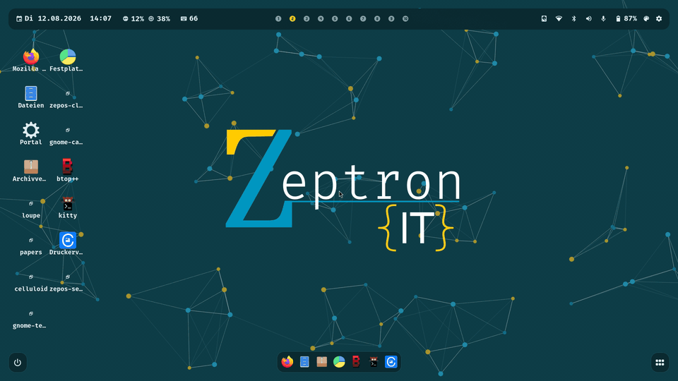

# ZepOS

**An Arch-based Linux distribution with a Hyprland desktop, an installer of its
own — and the AI coding agent already on the disk.**

[](https://github.com/ZeptronIT/ZepOS/releases)
[](LICENSE)
[](https://github.com/ZeptronIT/ZepOS/commits/main)


*[Deutsch lesen →](README.de.md)*


<sup>Every picture in this file is a screenshot of a program in **this** tree —
no mock-up, no composite, no retouching. 23 of the 27 were taken by
`tests/render/` in a nested Hyprland with the shipped wallpaper behind the
glass, at a real 1920×1080; the four installer pictures come from QEMU, off the
release medium, and carry an older version stamp because of it.
[`docs/bilder/README.md`](docs/bilder/README.md) says how each one is made,
what was deliberately kept out of frame, how it was checked for anything
personal, and how to remake them.</sup>

---

## Finding your files

<a href="docs/bilder/dateien-finden.gif"></a>

<sup>**12.8 seconds, 9.9 frames per second measured** — 127 frames, none
dropped, 960×540, 788 kB. A recording and not a demo reel: one nested session
from end to end, made by `tests/render/film.py`, with nothing cut, sped up or
retouched. The typing and the Return key are real key events. **The launcher is
opened by the command `SUPER+SPACE` runs, not by the key itself** — a synthetic
keyboard cannot trigger a compositor keybinding, which is measured and written
down in [`docs/bilder/README.md`](docs/bilder/README.md). The clock in the bar
shows the same fixed stand-in date as every picture below.</sup>

---

## Everything on the screen

Every window below is the shipped one, from this commit. Click a picture for
the full-size version.

<table>
<tr>
<td colspan="2" align="center">
<a href="docs/bilder/leiste.webp"></a><br>
<b>The bar</b> · <sub>date, load and keyboard layout on the left, ten workspaces in the middle, eight status modules on the right — each one opens something</sub>
</td>
</tr>
<tr>
<td width="50%" align="center" valign="top">
<a href="docs/bilder/starter.webp"></a><br>
<b>The launcher</b><br><sub><code>SUPER+SPACE</code> — hyprlaunch with the ZepOS patch, and it calculates too</sub>
</td>
<td width="50%" align="center" valign="top">
<a href="docs/bilder/kontrollzentrum.webp"></a><br>
<b>The control centre</b><br><sub>one window, six pages, two groups in the sidebar</sub>
</td>
</tr>
<tr>
<td align="center" valign="top">
<a href="docs/bilder/dock-minimiert.webp"></a><br>
<b>The dock</b><br><sub>pinned applications, and to the right of the divider a <i>minimised</i> window</sub>
</td>
<td align="center" valign="top">
<a href="docs/bilder/sitzungsmenue.webp"></a><br>
<b>The session menu</b><br><sub><code>SUPER+M</code> — six actions, each with its own letter key</sub>
</td>
</tr>
<tr>
<td align="center" valign="top">
<a href="docs/bilder/tastenkuerzel.webp"></a><br>
<b>The shortcut list</b><br><sub>read out of the generated configuration, so it cannot drift</sub>
</td>
<td align="center" valign="top">
<a href="docs/bilder/stil-editor.webp"></a><br>
<b>The style editor</b><br><sub>69 colour keys, live, from the same file the rest of the system reads</sub>
</td>
</tr>
<tr>
<td align="center" valign="top">
<a href="docs/bilder/sperrbildschirm.webp"></a><br>
<b>The lock screen</b><br><sub><code>zepos-lock</code>, C and GTK4, on <code>ext-session-lock-v1</code></sub>
</td>
<td align="center" valign="top">
<a href="docs/bilder/installer-einteilung.webp"></a><br>
<b>The installer</b><br><sub>eight steps, its own — not archinstall with a skin</sub>
</td>
</tr>
</table>

<details>
<summary><b>And the other seventeen</b> — the Home and its two menus, the dock and launcher menus, the calendar, notifications, both settings windows, the picker, a 1366×768 notebook screen, and three more installer steps</summary>

### The Home, and the two menus on it

The Home is the surface behind every window. Right-click an icon, or right-click
the empty surface beside it — two menus, two jobs:

<table>
<tr>
<td width="50%" align="center" valign="top">
<a href="docs/bilder/home-menue-symbol.webp"></a><br>
<sub>on an icon</sub>
</td>
<td width="50%" align="center" valign="top">
<a href="docs/bilder/home-menue-flaeche.webp"></a><br>
<sub>on the empty surface</sub>
</td>
</tr>
</table>

### The same right-click, in the other two places

<table>
<tr>
<td width="33%" align="center" valign="top">
<a href="docs/bilder/dock.webp"></a><br>
<sub>the dock, nothing running</sub>
</td>
<td width="33%" align="center" valign="top">
<a href="docs/bilder/dock-menue.webp"></a><br>
<sub>right-click in the dock</sub>
</td>
<td width="33%" align="center" valign="top">
<a href="docs/bilder/starter-menue.webp"></a><br>
<sub>right-click in the launcher</sub>
</td>
</tr>
</table>

### What the bar opens

<table>
<tr>
<td width="33%" align="center" valign="top">
<a href="docs/bilder/kalender.webp"></a><br>
<sub>the calendar</sub>
</td>
<td width="33%" align="center" valign="top">
<a href="docs/bilder/benachrichtigung.webp"></a><br>
<sub>a notification arriving</sub>
</td>
<td width="33%" align="center" valign="top">
<a href="docs/bilder/benachrichtigungszentrum.webp"></a><br>
<sub>the notification centre</sub>
</td>
</tr>
</table>

### Settings — two windows, one settings file

<table>
<tr>
<td width="33%" align="center" valign="top">
<a href="docs/bilder/einstellungsfenster.webp"></a><br>
<sub>the shell's settings window</sub>
</td>
<td width="33%" align="center" valign="top">
<a href="docs/bilder/einstellungen-app.webp"></a><br>
<sub><code>zepos-settings-gui</code>, the separate application</sub>
</td>
<td width="33%" align="center" valign="top">
<a href="docs/bilder/vpn-einstellungen.webp"></a><br>
<sub>the VPN settings</sub>
</td>
</tr>
</table>

### The picker, the desktop in use, and a notebook screen

`zepos-menu` is the picker every list in ZepOS goes through — clipboard
history, printer selection, device selection. One window, one style.

<a href="docs/bilder/auswahlfenster.webp"></a>

The desktop while somebody works at it — Files open, the bar above, the dock
below with the running window marked:

<a href="docs/bilder/dateien.webp"></a>

And the same desktop on a 1366×768 notebook screen. The bar does not overflow;
it moves three of its status modules behind the collapse button on the right,
which is what that button is for:

<a href="docs/bilder/schreibtisch-1366.webp"></a>

### Three more steps of the installer

These three are not from the nested compositor: they were taken by
`./iso/test-boot.py --scenario release-install`, in QEMU, off the release
medium — which is why the version stamp along the bottom names an older build.

<table>
<tr>
<td width="33%" align="center" valign="top">
<a href="docs/bilder/installer-sprache.webp"></a><br>
<sub>step 1 — language</sub>
</td>
<td width="33%" align="center" valign="top">
<a href="docs/bilder/installer-bestaetigung.webp"></a><br>
<sub>step 8 — the last question</sub>
</td>
<td width="33%" align="center" valign="top">
<a href="docs/bilder/installer-fertig.webp"></a><br>
<sub>finished</sub>
</td>
</tr>
</table>

</details>

ZepOS is an Arch-based Linux distribution with a Hyprland/Wayland desktop,
shipped as a bootable live medium with its own graphical installer. Everything
on the screen — installer, login screen, bar, dock, launcher, control centre,
settings, lock screen, session menu — is written for this project, is GTK4, and
takes its colours, spacing and type scale from one file.

**It is beta.** It installs, it runs, and it updates itself from a signed
package repository. It has also been installed on exactly one physical machine
and in QEMU, it erases the disk it is given, and it has no backup or rollback of
its own. This file says which of those claims was measured, when, and with what.

**Language note:** this file and [`README.de.md`](README.de.md) are the same
document in two languages; keep both in sync when either changes. Build scripts
and developer documentation are English; source comments and the design
documents in `docs/` are largely German. The shipped user interface is English
and German.

---

## What "beta" means here

Not a label. Three concrete statements, each with the thing that measured it.

**What works, and was watched doing it.** The evidence is in
[`iso/README.md`](iso/README.md), which records what each boot and each
installation actually did — not what was intended:

| | Measured by |
|---|---|
| The medium boots into the installer on UEFI firmware | `./iso/test-boot.py --scenario release` |
| Somebody can drive that installer to a finished installation | `--scenario release-install` |
| What it installed boots with the medium unplugged | `--scenario release-installed` |
| An installed machine updates itself from the public repository, signature checked | `--scenario update`, plus `./packaging/verify-install.sh` into clean containers |
| Without a network the medium says something comprehensible instead of freezing | `--scenario release-install-ohne-netz` |
| Firmware with Secure Boot on rejects the medium, and exactly why | `--scenario secure-boot` |

`./iso/test-boot.py --help` lists all ten scenarios.

**What is published right now.** A version number written into this file would
be wrong the next day, so here are the two addresses that answer instead — and
one dated snapshot of what they said:

- Packages: <https://zeptronit.github.io/ZepOS/manifest.txt> names the version,
  the commit, the Arch snapshot and the sha256 of every package.
- Media: the [releases page](https://github.com/ZeptronIT/ZepOS/releases).

*Measured 24.08.2026:* the repository served **0.1.9 with 24 packages**, built
`2026-08-24T14:06:09Z` from commit `54269d9` and signed with
`157C1725A578B80C`; the newest medium was still
**`zepos-2026.08.19-x86_64.iso`, 1 324 056 576 bytes (1.23 GiB)**, because no
release since has carried an image. Tree and repository agree at `0.1.9` today —
see [`VERSION`](VERSION) for the tree, and the two links above for reality;
they part company again the moment somebody commits.

**What beta does not mean.** It does not mean feature-complete with bugs left
over. Whole capabilities are missing on purpose and are named below, in
[Known limits](#known-limits). Read that section before you install anything.

---

## AI-first, and exactly what that means

The claim on the first line is a claim, so here is the whole of it, with the
file that carries each part. Nothing below is planned, in progress or coming
soon; every line is in the tree today.

**Claude Code is a package of this distribution, not something you install
afterwards.** `packaging/zepos-claude-code/PKGBUILD` builds it from a pinned,
sha256-checksummed tarball on the npm registry — version `2.1.233-4` in the
published repository — and it is signed with the same key as everything else
ZepOS ships. `zepos-apps` depends on it, so it arrives with the desktop; it is
pinned in the dock and lies on the Home. The first login of a fresh
installation ends with the agent already on the machine.

**A normal user can install agent tooling globally, without `sudo`.** ZepOS
ships Node 24 LTS and npm (`nodejs-lts-krypton`, `npm`, both dependencies of
`zepos-desktop`), and `/etc/npmrc` from `zepos-config` sets npm's prefix to
`~/.local` — a directory the shell and `zepos-session` already have on `PATH`.
So one line gets you an orchestrator that drives Claude Code in several agent
roles:

```bash
npm i -g claude-flow
claude-flow --version
```

No root, and nothing written into pacman's `/usr/lib/node_modules/`. Your own
`~/.npmrc` still wins over the system file — measured in an empty container on
20.08.2026. **Ruflo (`claude-flow`) is deliberately not preinstalled**, and the
reason is in [What is installed](#what-is-installed).

**The distribution is built the way an agent can keep working on it.** This is
the part that is easy to say loosely, so: nearly every decision in this tree is
written down next to the code it governs, with the measurement it came from —
that is what the file headers in `src/` and `packaging/` are. Two single
sources of truth mean a colour or an icon is changed in one place and reaches
88 templates. And `tests/conftest.py` installs an isolation guard that stops
any test from spawning a process or writing outside a temporary directory,
which is what makes it safe to let something that is not a human run the suite
on a machine that matters. ZepOS was itself written this way, with Claude at
the keyboard for a large part of the tree; the conventions are the residue of
that, not a marketing position.

### What it is not

Said plainly, because a README that promises more than the first installation
delivers is the most expensive mistake a beta can make.

- **No local model and no inference runtime.** No llama.cpp, no ollama, no
  GPU/CUDA/ROCm stack, no quantised weights. Nothing on the medium runs a model.
- **No AI in the desktop itself.** No assistant in the bar, no natural-language
  command box, no voice, no AI in the installer, no AI in support or diagnosis.
  `zepos-doctor` is ordinary Python.
- **No memory, no vector database, no shipped agent roles.** There is no
  embedded store, no retrieval, no ZepOS-side agent framework, and no MCP
  server configured out of the box.
- **Claude Code needs an Anthropic account and a network.** It is Anthropic's
  proprietary CLI under its own licence, not part of ZepOS's GPL, and offline it
  does nothing. Remove the package if you do not want it.
- **"AI-first" here means the workstation, not the operating system's
  internals.** ZepOS gets an agent to work in one step instead of five, and its
  tree is written to be worked on by one. It does not think, and it does not
  run a model on your behalf.

**Planned, and therefore not claimed:** an assistant surface that belongs to
the desktop rather than the terminal. It is a *plan*, it is not in
[`docs/specs/`](docs/specs/) yet, and nothing in this repository implements any
part of it.

---

## Install it

### 1. Get a medium

Download the ISO from the
[releases page](https://github.com/ZeptronIT/ZepOS/releases) and check it
against the sha256 printed **in that release's notes** — the checksum is text on
the page, not a file next to the image, so `sha256sum -c` has nothing to read:

```bash
sha256sum zepos-<date>-x86_64.iso     # compare with the release notes
```

Write it to a USB stick with the tool you already trust. A published image lags
`main` by however long it has been since the last one; building the medium
yourself is the only way to get today's tree — see
[Build it yourself](#build-it-yourself).

### 2. Know these four things first

- **The machine must be started in UEFI mode.** The installer refuses a BIOS
  boot and says so, rather than erasing a disk to find out whether the result
  starts (`installer/core/firmware.py`).
- **Secure Boot has to be off.** The boot chain carries no signatures; measured,
  the firmware rejects `\EFI\BOOT\BOOTx64.EFI` outright.
- **A network connection is required.** The medium carries the ZepOS packages,
  but the Arch base comes over the network. Without one the installation fails —
  politely, having been measured doing so.
- **The disk you choose is erased completely.** Every partition is planned
  fresh; none is kept. There is no install-alongside and no dual boot. The
  reason is in the head of `installer/core/layout.py`: keeping existing
  partitions means matching their start sectors exactly against what `parted`
  finds, and getting that wrong aborts a half-finished installation. The
  partitioning page shows you what is on the disk before you agree to it.

There is no live desktop to try first. The release medium boots into the
installer and nothing else.

### 3. What the installer asks

Nine pages: language, network, disk, partitioning, encryption, user, time,
ZepOS, summary. It is a GTK4/libadwaita wizard; if the graphical session cannot
start, the same installer runs as a text interface, and that fallback happens
before any window is shown.

Disk encryption is LUKS2 and optional. If you take it, the boot splash is
enabled too — that is where the passphrase prompt lives. On an unencrypted disk
the splash stays off, because it would be decoration over a path nobody
measured.

Partitioning, bootloader and base installation are done by
[`archinstall`](https://github.com/archlinux/archinstall). Writing our own
partitioner would mean writing code whose bugs erase other people's disks.

`zepos-install` takes **no command-line arguments**. There is no `--config` flag
on a tool that erases disks; `ZEPOS_INSTALLER_SURFACE=gui` or `=tui` forces one
of the two surfaces, and that is all.

### 4. The first login

There is no autologin — the login screen always asks. The first login of an
account generates its entire configuration from the templates. Measured
20.08.2026, when there were 94 generation targets (there are 98 today):
**1117 ms** for a first, complete generation, and **260 ms** at a login where
nothing changed, because unchanged targets are skipped and the rest run
concurrently.

---

## Living with it

### The desktop in five minutes

77 key bindings ship by default, and the list of them is *read out of* the
generated configuration rather than kept in a second file beside it — which is
why it cannot drift from what the keys actually do. The full overview opens from
the shortcut module in the bar; it has no key of its own yet.

| Key | Does |
|---|---|
| `SUPER+SPACE` | Launcher |
| `SUPER+SHIFT+H` | Search everything at once — applications *and* key commands |
| `SUPER+Q` / `SUPER+SHIFT+Q` | Terminal (floating / tiled) |
| `SUPER+E` | Files |
| `SUPER+SHIFT+B` | Browser |
| `SUPER+B` | Show or hide the dock |
| `SUPER+M` | Session menu — lock, log out, restart, shut down, suspend, hibernate |
| `SUPER+L` | Lock the screen |
| `SUPER+S` | Screenshot a region and annotate it |
| `SUPER+ALT+V` | Clipboard history with favourites — works with or without the plugin |
| `SUPER+1…0`, `SUPER+SHIFT+1…0` | Go to a workspace / take the window along |
| `SUPER+F` / `SUPER+SHIFT+F` | Fullscreen / real fullscreen |
| `SUPER+SHIFT+X` | Close the window |

The right half of the bar opens the control centre — one window whose sidebar
holds six pages: network, Bluetooth, VPN, general, sound and display. Beside it
are the overlays the bar's other modules open: notifications, calendar, disks,
battery, wallpaper, the shortcut overview, the style editor and the settings.
All of them are built from the same kit, so a row, a button and a header look
the same wherever they appear.


### The three places an application can live

**The Home** is a surface behind every window with your applications on it as
icons — clickable, draggable, on every screen. It stores grid *places* rather
than pixel coordinates, because the usable area changes while you work: with
the dock retracted it is 40 points taller, and saved coordinates would move
every icon on every `SUPER+B`. It sits on the `bottom` layer and not on
`background`, where `swaybg` paints the wallpaper and restarts on every change —
measured, the icons would have vanished after the first wallpaper change.
Idle cost, measured: 0.00 % CPU, visible or covered.

**The dock** holds your pinned applications and, to the right of them and
slightly dimmed, your *minimised* windows. Minimising moves a window to the
special workspace `minimized`; a click brings it back to the workspace you are
looking at without taking the keyboard focus away from what you are typing in —
of the three Hyprland dispatchers that could do it, `movetoworkspacesilent` is
the only one that does exactly that, and the other two were measured doing
something else. Both corner buttons — power on the left, launcher on the
right — retract with the dock on `SUPER+B`.

**The launcher** on `SUPER+SPACE`. Right-click works in all three places, and
each menu can push an application to the *other* one:

| Right-click in … | … on an application |
|---|---|
| **Home** | Add to dock · Remove from Home |
| **Dock** | Add to Home · Remove from dock |
| **Launcher** | Add to dock · Add to Home |

If the application is already at the target, the item flips to "remove" instead
of disappearing — a right-click that sometimes acts and sometimes does not is
worse than one that always says what it will do. The change arrives everywhere
without a re-login: every surface watches the settings file, measured at about
**40 ms** in all three directions.

All three menus are up in [Everything on the screen](#everything-on-the-screen),
next to each other — and so is what the desktop looks like while somebody is
working at it.

### What is installed

`zepos-desktop` is a meta package, and its `depends` list is where the shape of
an installed ZepOS is decided. The rule stands at the top of its PKGBUILD: *a
dependency is a program the generated configuration starts by itself, or one a
default keybinding needs in order to do what the key says.*

It pulls in Hyprland with five plugins, the AGS bar, dock and shell, the ZepOS
menu / lock / settings programs, and `zepos-apps` — the selection of *other
people's* applications ZepOS makes: Firefox, Nautilus, Loupe, Papers, Celluloid,
GNOME Text Editor, Calculator, Baobab, File Roller, btop, CUPS, and kitty as the
terminal. Each was chosen GTK4-first where a GTK4 version exists, and the reason
stands next to the name in `packaging/zepos-apps/PKGBUILD`. Firefox is the
deliberate exception: it is GTK3, and a browser the user asked for by name
outweighs a rule that is about *our own* surfaces.

Two optional groups are not installed by default: `zepos-apps-office`
(LibreOffice with German dictionaries) and `zepos-apps-devel` (`base-devel`,
`git`).

`zepos-apps` also includes **Claude Code**, packaged as `zepos-claude-code` from
a pinned, checksummed upstream tarball and pinned in the dock. It is Anthropic's
proprietary CLI under its own licence, not part of ZepOS's GPL, and it needs an
Anthropic account to do anything. Remove the package if you do not want it.

**Ruflo is not shipped, and that is a decision.** Ruflo (on npm: `claude-flow`)
is an orchestrator that drives Claude Code. It shipped as a package from 19 to
20 August 2026 and was removed again: it drives Claude Code, Claude Code talks to
the Anthropic API, and without a network neither does anything at all. The one
advantage preinstalling has — independence from the network — therefore does not
exist for this particular tool, and a package would have pinned one version
while npm keeps shipping new ones.

ZepOS brings Node 24 LTS and npm, so one command fetches it — **without `sudo`**:

```bash
npm i -g claude-flow
claude-flow --version
```

`/etc/npmrc` sets npm's prefix to `~/.local`, so the program lands as
`~/.local/bin/claude-flow`, on a PATH that already contains that directory. A
global `npm i -g` needs no root here and does not write into pacman's
`/usr/lib/node_modules/`. Your own `~/.npmrc` still wins — measured in an empty
container on 20.08.2026.

### Updates

An installed machine updates itself: a daily timer, delayed after boot and
randomly spread, that touches **only what comes from `[zepos]`**. The Arch base
is counted and reported, never installed, unless you set `update.scope=all`. An
unattended `pacman -Syu` on a rolling release is a machine that one morning does
not start — and whose owner did not break it.

By hand:

```bash
sudo zepos-update                    # install what is pending, then regenerate
sudo zepos-update --check            # only look, and say what is pending
sudo zepos-update --status           # what the last run did
sudo zepos-update --apply-schedule   # ONLY set the timer; installs nothing
```

The distinction nobody should have to guess: **`zepos-update` with no argument
(or `--now`) is what exchanges packages.** `--apply-schedule` writes a systemd
override and nothing else. Its old name `--apply` still works, because
`/usr/share/libalpm/hooks/90-zepos-update.hook` calls it that way and a hook on
disk gets called by the very update that replaces it — but a human who types it
is told, in so many words, that nothing was installed.

Regeneration is the other half. If a regeneration is pending **and** a terminal
is attached **and** the calling account is logged in graphically, `zepos-update`
runs `zepos-generate --all` as that account and restarts the shell, so no
re-login is needed. The timer, which is none of those three things, leaves a
marker instead, and the next login regenerates before the compositor starts.
`--regenerate` forces it either way; `zepos-update --check` says whether one is
pending.

### Settings

Two surfaces over one brain, and they cannot disagree, because only one of them
decides anything:

```bash
zepos-settings get                   # every setting, with its current value
zepos-settings set sizes.scale 1.25
zepos-settings set colors.<key> '#...'
zepos-doctor                         # what a generated configuration cannot check itself
```

The settings window has seven pages — size, displays, bar, theme, colours,
weather, updates. Every one of the 69 colour keys derived from ZeptronIT's six
brand colours is reachable, and the style editor's first theme preset *is* the
shipped palette rather than a copy of it.

### Changing it

Nothing in a running ZepOS is a configuration file somebody edited; everything is
generated, carries a "DO NOT EDIT" header, and is overwritten on the next run.
That does not lock you out — it moves the edit one step back:

```bash
mkdir -p ~/.config/zepos/templates
cp /usr/share/zepos/templates/hyprland-universal-config.template ~/.config/zepos/templates/
$EDITOR ~/.config/zepos/templates/hyprland-universal-config.template
zepos-generate --all
```

A template under `~/.config/zepos/templates/` wins over the packaged one of the
same name, and a package update cannot overwrite it. This is also what the
shortcut window's edit button does — see [Known limits](#known-limits) for what
that button is *not*.

Generation is atomic: write into a temporary directory, validate, then move. A
failed run leaves the previous working configuration in place.

---

## Known limits

Everything here is measured, or read out of this tree. Nothing is softened, and
nothing found while writing this file was left out.

### Hard limits

- **x86_64 only.** Arch itself officially ships x86_64 only, and ZepOS builds on
  Arch's own tooling and archive, so it inherits that boundary rather than
  choosing it. To name the CPU people ask about: an AMD Ryzen is x86_64.
- **UEFI only, and Secure Boot off.** Both measured; see
  [Install it](#install-it).
- **A network connection is required to install.**
- **The disk is erased. No dual boot, no migration.** ZepOS is installed, not
  converted.
- **No backup and no rollback of its own.** The roadmap lists "backup and
  restore" as open, with the sentence it deserves: an operating system without a
  way back is a test rig. Until that exists, your way back is your own backup,
  made *before* you install.
- **Two languages: German and English.** Both are held complete by tests — an
  English string with no German translation fails the suite.
- **One desktop, and it is Hyprland.** That is the point of the project, not an
  omission.
- **Hardware coverage is one physical machine plus QEMU.** There is no hardware
  matrix, and no claim about yours.

### Rough edges, named one at a time

- **Displays cannot be arranged against each other in the new settings window.**
  Per screen it does on/off, resolution, scale and rotation. Dragging monitors
  into position exists only in the older GTK window
  (`zepos-settings-gui --page bildschirme`), because that is where the drawing
  area with the drag gesture lives. The new page says so instead of offering a
  button that does nothing.
- **The VPN settings window overflows horizontally by 42 px.** Measured: its
  content needs 702 px, and the width rung it sits on gives it 634. That is a
  choice of rung, not a rounding error, and either fix visibly changes a window
  nobody complained about — so it is recorded rather than quietly patched.
- **There is no shortcut editor.** The shortcut window's edit button opens the
  keybinding *template* in a text editor. No key capture, no conflict check, no
  per-binding interface.
- **The login screen is only half translated.** It is `greetd` running `regreet`
  inside `cage`, styled from the same brand file as everything else — but
  `regreet` itself translates two of the eight strings on the mask. The other six
  are English whatever language you installed.
- **Rebuilding a single package that others depend on fails.**
  `packaging/build.sh` removes the old copy before it installs the built
  repository into the container, so a dependent package briefly cannot resolve.
  Worked around twice by building the whole dependency circle at once; not
  fixed.
- **The test rig has no GTK theme.** A whole class of bug — a theme default our
  stylesheet never resets — is structurally invisible to it. The white ring the
  system theme drew around the dock icons was the first one found that way, and
  it was found by a person looking at a screen.
- **The suite cannot be collected in one call.** `tests/render/test_home.py` and
  `tests/src/test_home.py` share a basename, and pytest imports test modules by
  basename, so the second one it reaches is an import mismatch. Counting the
  suite needs two commands — see [Tests](#tests). Open since 0.1.8.
- **A Home that has been emptied completely keeps its last picture** until
  something else redraws it. Open since 0.1.8.
- **The gap between icon and text in the three right-click menus visibly varies
  between 9 and 12 px.** The rung is right; the ink of the glyphs is different
  widths. The clean fix sits in the shared row component and would touch every
  window. Open since 0.1.6.
- **The Bluetooth pairing dialogue is Blueman's, not ours.** 0.1.9 closed a
  security hole — until it, `bluetoothd` had no pairing agent at all and the
  kernel confirmed pairings by itself, silently — by registering Blueman's
  agent with `KeyboardDisplay` and giving it a window rule. Seven Blueman
  modules and its own notifications are switched off because they reach for the
  same adapter as the bar. A ZepOS pairing agent as an AGS window is in
  progress; until it lands, one surface on this desktop is somebody else's.
- **The state of the suite as of 24.08.2026**, so that a green run is not
  assumed: 3254 passed, 13 skipped, and eight that are not green.
  `test_no_program_opens_a_layer_shell_window_without_a_rule` fails on a *build
  leftover* under `iso/work/` rather than on source — the guard reads the whole
  tree, and an unclean `iso/work/` puts a second copy of `zepos-menu` in front
  of it. `tests/src/test_home.py` is the collection error above. The remaining
  six are `tests/render/test_schale_stil.py`, whose module fixture waits up to
  45 s for the control-centre surface and sometimes does not get it; the file
  itself records the measurement and names the suspect (an unconditional
  `grab_focus()` on the VPN page that fires whenever the shell opens, whichever
  page is showing).

### What no test covers

Worth saying plainly, because it explains the shape of the bug reports this
project gets. The suite checks *which* components a template calls, and computes
contrast; `tests/render/` measures real geometry under a nested compositor, but
only for a handful of surfaces. **No test draws a window and judges how it
looks.** A layout can be wrong in every visible way while the whole suite is
green. That gap is known, it is being narrowed one measurement at a time, and
until it closes, a human report beats a green run.

The pictures in this file come out of that same rig, which is why they can be
remade from any checkout — and why they are evidence of *geometry and colour*,
not of taste. Making them found two things a green suite had not:
`tests/render/shoot.py` claims in its own header that the bar fits completely on
a 1366×768 screen, and it does not — three status modules sit behind the
collapse button, which is visible in the screenshot above. And the Home lists
`xdg-desktop-portal-gnome`, a service entry marked `NoDisplay=true` that
`desktop_entries.installed()` filters out for the dock; the Home does not run
the same filter. Both are recorded here rather than fixed in passing.

### Signing and licences

- A **locally built** medium is signed with a throwaway key
  (`packaging/make-test-key.sh`, user id `ZepOS TEST KEY - DO NOT TRUST`, no
  passphrase, 90-day expiry). The real key never enters a checkout.
- The **published** repository is signed with a real key —
  `FF2EB06C08A57FEA9E33FC46157C1725A578B80C`, user id
  `LeonMarzollDev (ZepOS Release)`, expiring 18.08.2028. See
  [Packages and signing](#packages-and-signing).
- **Three of the five compositor plugins come from an upstream tree with no
  licence at all.** ZepOS has permission to build and patch them; you do not
  automatically inherit one. See [Licence](#licence) — this is the one limit
  here that is a legal fact rather than a missing feature.

---

## Who this is for, and who it is not for

**For** people who want a Hyprland desktop that is configured, coherent and
installable rather than assembled from a dotfiles repository over a weekend —
and for people who want to read *why* a system is put together the way it is,
because nearly every decision in this tree is written down next to the code,
with the measurement it came from.

**Not for** anyone who needs Secure Boot, an offline install, a second desktop
environment, an architecture other than x86_64, or a machine whose contents
matter and are not backed up somewhere else.

---

## Under the hood

### The template system is the core

Two single sources of truth — `src/icon_definition.py` for icons, and
`src/style_definition.py` with `src/brand.py` and `src/sizes.py` for colours,
sizes and spacing — feed a processor that expands `{{ICON_*}}` and `{{STYLE_*}}`
placeholders into **88 templates** in `src/templates/` and **8 stylesheet
templates** in `src/styles/`, which `zepos-generate` turns into **98 targets**.
The result is the configuration Hyprland, AGS, kitty and the rest actually read.

```
icon_definition.py ─┐
brand.py ───────────┼─► template_processor.py ─► generate_config.sh ─► ~/.config/{hypr,ags,kitty,…}
style_definition.py ┘        (88 + 8 templates)      (zepos-generate, 98 targets)
user-settings.json ─┘
```

```bash
zepos-generate --all          # regenerate everything
zepos-generate --help         # every individual target
```

### The installer is three layers, and the interface never talks to archinstall

| Layer | Contents |
|---|---|
| `installer/core/` | Data model, validation, disk enumeration, LUKS2, wireless, translation to `archinstall` |
| `installer/gui/` | The GTK4 / libadwaita wizard |
| `installer/tui/` | Text interface, used when the graphical session cannot start |

The interface fills a serializable configuration model; a translation layer
converts it into `archinstall`'s JSON; a runner invokes its documented
command-line interface. So the two interfaces are interchangeable, and an
unattended installation needs no second code path — `InstallConfig.from_dict()`
plus `installer.core.runner.install()` is the whole of it.

Wireless credentials are carried into the installed system on purpose:
associating in the live environment does not give the installed system network
access, and a laptop with no ethernet port would otherwise boot with no way to
get online.

The repository an installation is performed *with* is not the one that remains.
An offline install reads its ZepOS packages from `file:///opt/zepos-repo` on the
medium; `installer/core/pacmanconf.py` removes every `[zepos]` section from the
target's `pacman.conf` and appends exactly one pointing at the online
repository. Replacing rather than editing is what makes the result independent of
how many were there.

### Packages and signing

`packaging/` holds **19 recipes producing 24 packages**, built in dependency
order inside a container pinned to the same Arch Linux Archive snapshot as the
ISO. The private signing key never enters the build container: packages are
built there, signing happens on the host afterwards.

The published repository and every package in it are signed with
`FF2EB06C08A57FEA9E33FC46157C1725A578B80C`, user id
`LeonMarzollDev (ZepOS Release)`, expiring 18.08.2028. The primary key can only
certify (`[C]`); a dedicated subkey (`[S]`) does the actual signing — the usual
split between the key that vouches for the others and the key that gets used
every day. Its public half is published at
[`zeptronit.github.io/ZepOS/zepos-repo.pub`](https://zeptronit.github.io/ZepOS/zepos-repo.pub),
and the `zepos-keyring` package carries the same file, which is what makes a
freshly installed system trust it without anyone typing a fingerprint by hand.
`packaging/README.md` has the mechanics.

### What is on the screen, and why we wrote it

| | Replaces | Why |
|---|---|---|
| `zepos-menu` | wofi | GTK3, and six generated call sites depend on the chooser |
| Session window (AGS) | wlogout | GTK3, upstream dead since 2024 |
| `zepos-lock` | hyprlock | Renders with GLES and Cairo, so its colours could never come from `brand.py` |
| AGS bar and dock | waybar, nwg-dock-hyprland | waybar is gtkmm-3; nwg-dock has no GTK4 version |
| `zepos-settings-gui` | nwg-displays | GTK3, and its "keep these settings?" timer dies with the program it is protecting |
| `hyprlaunch`, `hyprclipx` | — | Built from [azzuriel](https://github.com/azzuriel)'s plugins, patched by ZepOS; 116 lines of hardcoded CSS replaced by generated stylesheets. See [Licence](#licence) |

GTK4 throughout is a hard rule, not a preference: a GTK3 component is a component
whose colours and spacing cannot come from the same source as everything else,
which is the one property that makes a distribution look like one system. The
rule is about surfaces ZepOS builds — not about other people's applications,
which is why Firefox is here.

Two surfaces exist that a user meets before the desktop does:

- **The login screen** is `greetd` running `regreet` inside `cage`, with
  `tuigreet` on the console as a fallback if the graphical attempt fails twice.
  It follows the language the machine was installed in, with the caveat under
  [Known limits](#known-limits).
- **The boot splash** is a generated Plymouth theme, derived from `brand.py` and
  the logo, checked in and re-derived by a test. It is enabled **only for
  encrypted installations**. Enabling it rewrites `mkinitcpio.conf`, verifies the
  result, and rolls back on any doubt.

---

## Design decisions worth knowing

- **The desktop must start even when plugins fail.** Hyprland plugins are tied to
  an exact Hyprland version, so a minor version moving before the plugin packages
  are rebuilt produces a machine whose plugins cannot load. Everything needing a
  loaded plugin lives in one generated file, and a block is written only when the
  compiled object is on the machine; otherwise its place is taken by a comment
  naming the object, the package that provides it, and the command to re-run.
  With no plugins at all the file is nothing but comments, which is still a
  configuration that parses — measured with `Hyprland --verify-config` and
  asserted both ways by `tests/src/test_plugins.py`. A version mismatch costs a
  feature, not a session.
- **Contrast is a correctness question, not taste.** WCAG AA asks 4.5:1 for text,
  and the brand's own accent does not reach it — `#0096C0` on `#0D3D47` is
  3.45:1 — so the cyan that is *read* is that hue lightened to 6.04:1, while the
  untouched `#0096C0` stays where it is *seen*. The tests recompute every pair
  rather than trusting the numbers written beside them. Green and red are
  deliberately **not** on brand: a distribution that recolours its failure states
  to the company's cyan is hiding failures in order to look tidy.
- **Shipping a brand is not imposing one.** All 69 colour keys are settable.
- **German and English are maintained as equals**, via gettext, in two domains —
  the installer and the desktop shell. English source strings are the msgids; the
  German catalogues are first-class, and the suite fails on a missing entry,
  because a missing entry means a German user silently reads English.
- **Delete dead code rather than deprecating it.** Where the word "deprecated"
  appears in this tree it is a *runtime* message telling a user which command
  replaced the one they typed — a redirection, not a tombstone.

---

## Build it yourself

Both builds run in Docker containers, because a package built against whatever
happens to be on a workstation has a dependency list that describes that
workstation.

You need `git`, `gpg`, `rsync`, `repo-add` (from `pacman`), and Docker reachable
as **`sudo -n docker`** — the scripts never prompt for a password, so
passwordless sudo for `docker` has to be configured first. Budget roughly 10 GB
of free disk for one release build: measured, a 3.5 GB archiso work directory, a
1.3 GB image, and the build containers on top.

```bash
git clone https://github.com/ZeptronIT/ZepOS.git
cd ZepOS

# 1. A signing key. The real one is never in this repository, so for a local
#    build you make a throwaway. It says DO NOT TRUST on purpose, has no
#    passphrase, and expires after 90 days. It prints the exact next command.
./packaging/make-test-key.sh

# 2. The packages and the pacman repository they are served from.
ZEPOS_GNUPGHOME=packaging/keys/gnupg ./packaging/build.sh --key <printed id>

# 3. The installation medium, out of exactly those packages.
./iso/build.sh --profile release
```

The image and its manifest land in `iso/out/` as `zepos-<YYYY.MM.DD>-x86_64.iso`
and `manifest-release.txt`. The build's last line is the command that boots what
it just made in QEMU:

```bash
./iso/test-boot.py --scenario release
```

Useful variations, every one of them in the script's own `--help`:

```bash
./packaging/build.sh zepos-config        # one recipe instead of all of them
./packaging/build.sh --no-sign           # an unsigned repository
./packaging/build.sh --rebuild-image     # rebuild the build container too
./iso/build.sh                           # the smoke ISO (see below), not the medium
./iso/build.sh --snapshot current        # build against today's mirrors
```

Two things that will bite otherwise:

- `--no-sign` silently drops `zepos-keyring` and `zepos-desktop` from a full
  build: a keyring package built around no key, and a meta package that depends
  on it, are not things that can exist.
- Rebuilding **one** package that others depend on currently fails — see
  [Known limits](#known-limits). Build the dependency circle together.

**There are two ISO profiles and they are not interchangeable.** `iso/profile/`
is a test harness: it logs a user in, ships its own `/etc/shadow`, installs
unattended from an answer file with a root password in it, and puts
`console=ttyS0` on the kernel command line. `iso/profile-release/` is the image a
person can be handed. The shipping profile is assembled from an allow-list
(`iso/shared-with-release.txt`) rather than being a second copy, so that a new
file in the harness cannot reach a download by being forgotten.

---

## Development

### Requirements

Python 3.14, `archinstall` 4.4, GTK4 with libadwaita and PyGObject for the
graphical interfaces, `iwd` for wireless, `gettext` to compile the catalogues,
`docker` for the package and ISO builds.

### Tests

```bash
python -m venv .venv
.venv/bin/pip install pytest
.venv/bin/python -m pytest
```

**3303 tests in 132 files**, counted 24.08.2026. They need nothing but Python
and pytest; tests that would need QEMU, OVMF, a built package repository or a
real Hyprland skip themselves when those are absent.

Counting them takes two commands rather than one, and that is a bug, not a
style: `tests/render/test_home.py` and `tests/src/test_home.py` share a
basename, so a single `pytest --collect-only` stops with an import mismatch
after 3274 of them. Until one of the two is renamed:

```bash
.venv/bin/python -m pytest --collect-only -q --continue-on-collection-errors  # 3274
.venv/bin/python -m pytest --collect-only -q tests/src/test_home.py           # +29
```

A full run on 24.08.2026 took **11 min 55 s** and ended 3254 passed, 13
skipped, 1 failed, 7 errors — see [Known limits](#known-limits) for what those
eight are.

**There is no CI.** `.github/` holds issue and pull-request templates and no
workflows. Nothing runs these tests unless a person runs them, which is exactly
why a pull request is expected to say that they were run and what came back.

The suite has an **isolation guard**: no test may spawn a real process or write
outside a temporary directory — where "write" includes deleting, renaming,
re-permissioning and symlinking. The installer drives `iwctl`, `archinstall` and
NetworkManager, so without that guard a careless test could drop your wireless
connection or overwrite your live network profiles. Tests that genuinely need an
exception opt in visibly with `@pytest.mark.allow_subprocess` or
`@pytest.mark.allow_system_writes`; [CONTRIBUTING.md](CONTRIBUTING.md) explains
what that costs.

### Layout

```
src/            the desktop: templates, the SSOTs, the generator, the zepos-* commands
installer/      the installer, in three layers
packaging/      19 PKGBUILD recipes, the build container, signing and publishing
iso/            two archiso profiles and the build that assembles them
lock/           zepos-lock (C, GTK4, gtk4-layer-shell)
menu/ settings/ zepos-menu and zepos-settings-gui (Python, GTK4)
plugins/        ZepOS' own patches only; upstream source is fetched at build
                time from a pinned commit, not vendored (see plugins/LICENSE)
po/             gettext: the zepos-installer and zepos-desktop domains
tests/          132 test files and one isolation guard
docs/specs/     the design document and the roadmap (German)
```

`packaging/README.md` and `iso/README.md` are long and worth reading before
changing anything under them — they record what was measured, not only what was
decided.

### Contributing

See [CONTRIBUTING.md](CONTRIBUTING.md). The short version: changes go into
templates, not into generated files; a claim in a commit message is expected to
name the thing that measured it; and `pytest` is expected to pass before a pull
request. Bug reports are the most useful thing right now — the
[issue templates](https://github.com/ZeptronIT/ZepOS/issues/new/choose) ask for
what a report needs.

ZepOS is written by [LeonMarzollDev](https://github.com/LeonMarzollDev)
(ZeptronIT), with Claude as the assistant at the keyboard for a large part of the
tree. That is stated because it is true and visible in the history, not as a
selling point.

### Reporting a vulnerability

See [SECURITY.md](SECURITY.md). Do not open a public issue for a security
problem.

---

## Licence

GPL-3.0-or-later for ZepOS's own code. See [LICENSE](LICENSE).

ZepOS's desktop depends on five compositor plugins it does not itself hold the
copyright to. Their situations are not the same, and this table exists so a
reader can tell them apart without reading five PKGBUILDs:

| Plugin | Author | Origin | Licence | What ZepOS does with it |
|---|---|---|---|---|
| `hyprbars` | [hyprwm](https://github.com/hyprwm) (the Hyprland project) | [hyprwm/hyprland-plugins](https://github.com/hyprwm/hyprland-plugins), tag-pinned commit | BSD-3-Clause, real `LICENSE` file | Built unmodified; configured with ZepOS's own colours and icons at the config layer only |
| `borders-plus-plus` | [hyprwm](https://github.com/hyprwm) (the Hyprland project) | [hyprwm/hyprland-plugins](https://github.com/hyprwm/hyprland-plugins), tag-pinned commit | BSD-3-Clause, real `LICENSE` file | Built unmodified, loaded with no settings of its own |
| `hyprzones` | Jan Ohlmann ([azzuriel](https://github.com/azzuriel)) | [azzuriel/hyprzones](https://github.com/azzuriel/hyprzones), commit-pinned | **None** — GitHub reports `license: null`; no `LICENSE` file, no copyright notice anywhere in the tree | Built unmodified, no ZepOS changes |
| `hyprlaunch` | Jan Ohlmann ([azzuriel](https://github.com/azzuriel)) | [azzuriel/hyprlaunch](https://github.com/azzuriel/hyprlaunch), commit-pinned | **None** — same as above | Fetched and patched at build time; the patch is ZepOS's own work |
| `hyprclipx` | Jan Ohlmann ([azzuriel](https://github.com/azzuriel)) | [azzuriel/hyprclipx](https://github.com/azzuriel/hyprclipx), commit-pinned | **None** — same as above | Fetched and patched at build time; the patch is ZepOS's own work |

`hyprbars` and `borders-plus-plus` are unremarkable: a serious upstream, a real
licence, no ZepOS changes to the plugin code itself. The other three are not, and
the reason is the same for all three — measured 11.08.2026, at the GitHub API and
in each tree by hand: no `LICENSE` file, no `Copyright` line, `"license": null`.
Code with no licence is, under copyright law, "all rights reserved" regardless of
what a file header claims.

**What that means, and what ZepOS actually did about it.** Leon Marzoll
(ZeptronIT) — who has contributed to these same upstream trees, and so holds
copyright in his own contributions to them — gave ZepOS permission on 11.08.2026
to build from and modify all three. That permission is recorded verbatim, with
the exact commits, in [`plugins/LICENSE`](plugins/LICENSE). It is a **permission,
not a licence**: it says what *ZepOS* may do, and says nothing about what *you*,
installing ZepOS, may do with the code you receive. A security review ahead of
this repository's publication drew the sharper line that the permission does not
cross: it does not cover ZepOS republishing a *copy* of the unlicensed source
itself. Building from it is one thing; redistributing it is another.

**So this repository does not carry the source of `hyprlaunch` or `hyprclipx` at
all.** `packaging/zepos-hyprlaunch/PKGBUILD` and
`packaging/zepos-hyprclipx/PKGBUILD` fetch it themselves at build time, from the
author's own repository, pinned to the exact commit
[`plugins/LICENSE`](plugins/LICENSE) names — never a moving branch, so the build
stays reproducible — the same way an AUR package would. `hyprzones` was never
vendored in the first place and works the same way. ZepOS's own modifications —
replacing hardcoded CSS and window sizes with generated stylesheets, adding the
clipboard collector, fixing a path that reached under `$HOME` — are ZepOS's own
diffs, live beside their recipes, and are licensed GPL-3.0-or-later. The built,
published package is unaffected by any of this: the ISO still ships the finished
plugin, only the unmodified upstream *source* is no longer redistributed by this
repository.

All three recipes therefore declare `license=('custom')` rather than assert a
licence that does not exist. Closing the underlying gap needs one commit in Jan
Ohlmann's own repositories — a `LICENSE` file, once, and the question never comes
up again for anyone downstream of it — and it should be closed; until it is,
`plugins/LICENSE` is the honest account of where things stand.

---

## The numbers in this file

Recounted on **24.08.2026** in this tree, or asked of the published service,
rather than carried over from the previous revision of this file. That is not a
formality: five of the numbers that stood here on 20.08.2026 had gone stale in
four days, and they are marked below.

| Number | How it was obtained |
|---|---|
| 3303 tests, 132 files ← *was 3121 / 121* | `pytest --collect-only -q --continue-on-collection-errors` (3274) **plus** the same on `tests/src/test_home.py` (29), because those two cannot be collected in one call; `find tests -name 'test_*.py' \| wc -l` |
| 19 recipes, 24 packages | every `pkgname=` in `packaging/*/PKGBUILD`; the published `manifest.txt` lists 24 |
| 88 templates, 8 stylesheet templates ← *was 85 / 7* | `ls src/templates \| wc -l`, `ls src/styles \| wc -l` |
| 98 generation targets ← *was 94* | `zepos-generate --help \| grep -c '^  -[a-z]'` |
| 1117 ms / 260 ms | measured 20.08.2026 against the generator's own test fixture, when there were 94 targets. Not re-measured — the number and its date belong together |
| 77 key bindings | `grep -c '^bind' src/templates/hyprland-universal-config.template` |
| 6 brand colours, 69 colour keys | `brand.BRAND`, `brand.COLORS`, executed |
| 1 324 056 576 bytes of ISO | the published release asset of `v2026.08.19`, asked with `gh release view --json assets` |
| 10 boot scenarios | `iso/test-boot.py --help` |
| 7 settings pages | `settings/zepos_settings_gui/model.py`; and visible in the settings screenshot above |
| 6 control-centre pages | `src/templates/ags-control-center.template`; and visible in the screenshot above |
| 3.45:1 and 6.04:1 | `src/brand.py`, recomputed by the tests on every run |
| ~40 ms for a pin to arrive everywhere | measured for release 0.1.8, in all three directions |
| Published 0.1.9, 24 packages, key, build time ← *was 0.1.3* | fetched from `https://zeptronit.github.io/ZepOS/manifest.txt` |
| 3254 passed / 13 skipped / 1 failed / 7 errors in 11 min 55 s | `.venv/bin/python -m pytest -q --continue-on-collection-errors`, 24.08.2026 |
| 27 pictures, 2 058 966 bytes = 1.96 MiB | `du -cb docs/bilder/*.webp`; three are a whole 1920×1080 desktop, one a whole 1366×768 one, four are 1280×800 out of QEMU, the other nineteen are cropped to the window they show — `magick identify` on the committed files, not on the setting that produced them |
| Every conversion to WebP lossless | `magick compare -metric AE` printed `0` for every picture converted whole |
